## Chà 😊, một hành trình dài và mọi kế hoạch đã đúng đến `99%`, hơn cả những gì tôi mong đợi. Kết quả là tôi vừa pass chứng chỉ vỡ lòng của `AWS`, `Cloud Practitioner CLF-C02` mà tôi biết đến cách đây vài tháng.

## Kể từ lúc đi re:Invent 2026 của AWS HCM, cụ thể bạn có thể đọc ở đây:

## `https://www.linkedin.com/pulse/aws-reinvent-recap-2025-vietnam-dung-ha-anh-idbbc/` do anh `Dung-ha-anh` viết

## Sau thời gian trên, tôi đã ấp ủ ý tưởng chinh phục các `Cert` của `AWS` ngay và luôn. Hôm nay là cột mốc đầu tiên của tôi.

# 1. Lợi ích của chứng chỉ `AWS CLF-C02`

## Đây là chứng chỉ khi bạn pass

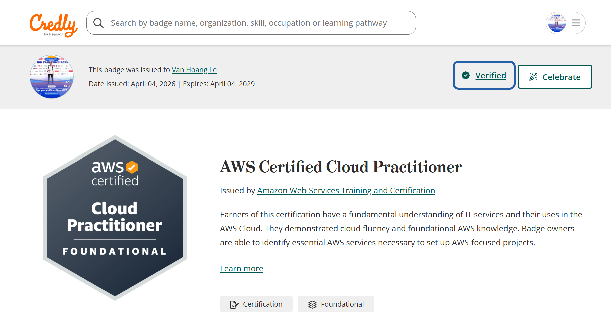
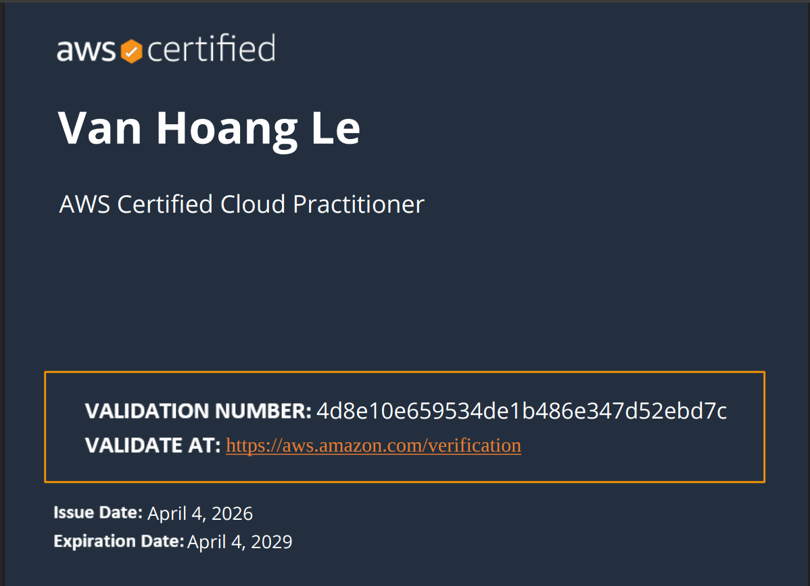

## Có lẽ điều này ai cũng biết rồi vì gần đây các Cert của AWS đang là `Trend` từ `HR`, `Marketing`, `Non-Tech`, ... ai cũng biết nó mang lại nhiều lợi ích như thế nào.

- Lợi ích đầu tiên: Nó là điểm khởi đầu cho những cert quan trọng sau này, nếu bạn pass `CLF-C02` bạn sẽ được voucher giảm giá `50%` có Cert tiếp theo
- Thứ 2: Giúp bạn tăng tự tin về nền tảng Cloud nơi bắt đầu tất cả về hệ sinh thái đám mây, việc này giúp bạn trong mọi lĩnh vực ngành nghề phổ biến tại `Việt Nam` như Dev, AI, IoT, Big Data hoặc các ngành khác như marketing, hr, tư vấn về cloud
- Thứ 3: Kiến thức nền tảng để học lên các Cert cao hơn như `AWS SAA-C03`, `AWS DVA`, ... còn rất nhiều Cert cấp cao khác.

## Điển hình ở đây là danh sách `12 Cert chính của AWS`

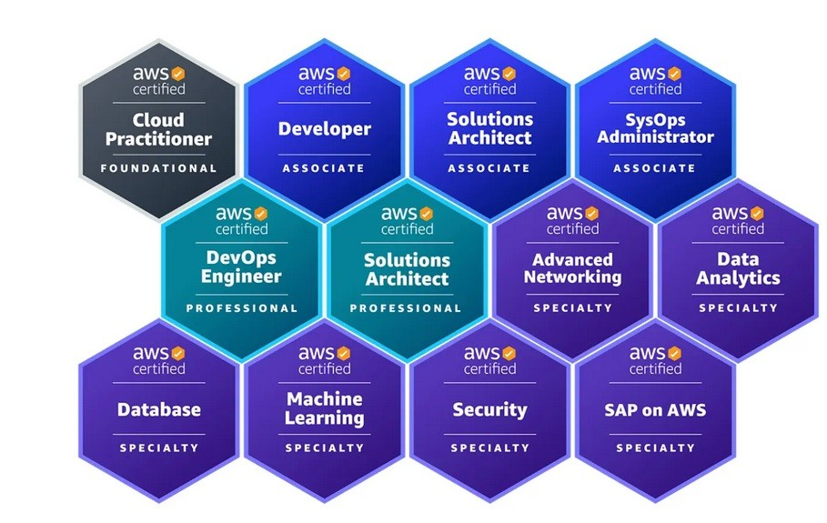

# 2. Nội dung thi chứng chỉ AWS CLF-C02

### Vì `CLF-C02` là cert nền tảng mở đầu nên các câu hỏi khá đơn giản, không đánh đố nhiều. Thực tế khi tôi thi, cấu trúc đề giống như hỏi từ vựng tiếng Anh vậy. Tuy nhiên không nên chủ quan nếu chỉ cho rằng nó đơn giản mà học qua loa, vì nó đòi hỏi bạn học khá nhiều service rất rộng như `EC2`, `S3`, ...

## 2.1 Tổng quan

- Chi phí thi: `100$`. Tuy nhiên có vài cách để bạn có thể mua từ bên thứ 3 với giá rẻ hơn. Mình đã mua từ shop này khá uy tín, bạn có thể tham khảo, giá còn tầm `900k`. Vì đây là voucher giảm giá 100% nên yên tâm hơn so với các voucher 50% (có thể bị `AWS` quét).
  `https://www.facebook.com/groups/1204797124657101`
  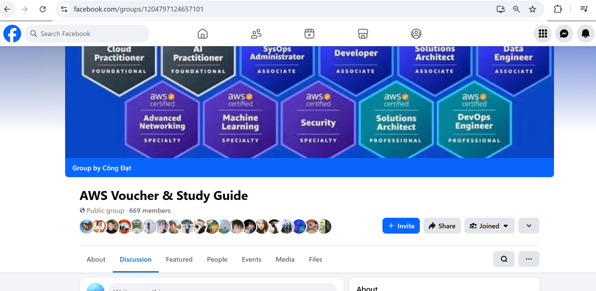
- **Thời gian thi:** Bạn được `90 phút` để làm bài thi, được cộng thêm `30 phút` nếu ngôn ngữ mẹ để không phải tiếng anh. Thực tế thì làm tầm 40-50 phút là xong, rà soát lại mấy câu cần kiểm tra cũng mất 3 phút là ok rồi
- **Cấu trúc đề**: Sẽ có 65 câu hỏi (chọn 1 hoặc nhiều đáp án), nhưng trong thực tế chủ yếu là chọn 1 hoặc 2 đáp án. Sẽ có 15/65 câu là câu nhiễu, mục đích `AWS` muốn thử nghiệm các câu hỏi mới (ví dụ về `AI`) hoặc câu lắt léo để đánh giá đề. 15 câu này không tính điểm vì chỉ mang tính chất thử nghiệm, khảo sát thí sinh.
- **Điều kiện Pass:** Chỉ cần đạt từ 70%, tức là 700 score / 1000 score là được.
- **Thời hạn chứng chỉ:** `3 năm`

## 2.2. Chi tiết về các nội dung câu hỏi

### Các câu hỏi sẽ được chia như sau theo tài liệu học chính thức của `AWS`

| Section                                 | % of Scored Items |
| --------------------------------------- | ----------------- |
| Domain 1: Cloud Concepts                | 24%               |
| Domain 2: Security and Compliance       | 30%               |
| Domain 3: Cloud Technology and Services | 34%               |
| Domain 4: Billing, Pricing, and Support | 12%               |

# 3. Quá trình ôn thi

## 3.1. Học Lý thuyết

### Về cơ bản bạn không cần phải học ở quá nhiều nguồn. Tôi chỉ học ở một nơi duy nhất là khoá học của `AWS`. Nhiều người sẽ học theo `Udemy`, việc này hoàn toàn ổn, nhưng bạn sẽ tốn một khoản vài trăm nghìn không cần thiết trong khi `AWS` là quá đủ để học. Cụ thể mình để nguồn ở đây:

`https://skillbuilder.aws/learn/94T2BEN85A/aws-cloud-practitioner-essentials/8D79F3AVR7`

### Sau khi học xong khoá này bạn sẽ được một Cert của chính AWS, nhưng cert này mang tính xác nhận hoàn thành khoá học nên không có giá trị bằng `CLF-C02`.

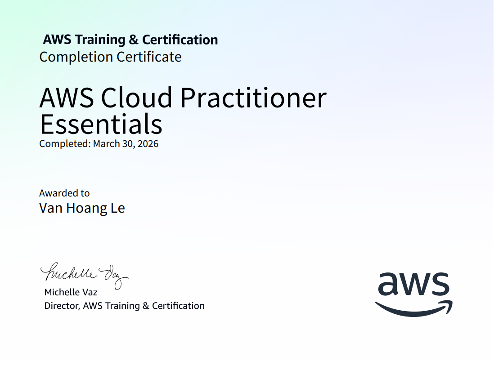

## Ngoài ra, trong quá trình học có một vài chỗ không hiểu, tôi dùng `Gemini` (hoặc AI khác) để giải đáp và giúp học nhanh hơn. Tôi thường dùng `Gemini` tạo đề sau mỗi phần học, và yêu cầu đề khó hơn đề thi thật rất nhiều. Nó giúp tôi rèn tư duy và đúng là khi đi thi tôi đỡ `bỡ ngỡ` hơn.

#### Ví dụ tôi đã làm

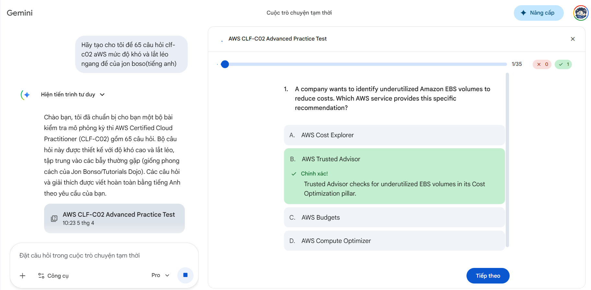

## 3.2 Luyện đề Free 0đ:

### Bạn không nhất thiết theo đám đông mua đề trên `Udemy` hay nguồn khác vì với `CLF-C02` thì luyện trên những nguồn sau là đủ pass. Tôi chỉ luyện trên:

### ExamPrepper: Luyện trên này là quá đủ vì câu hỏi khi thi khá sát. Nếu bạn luyện đề ở đây đạt tầm 90-95% trở lên thì bạn dư sức `pass` Cert này.

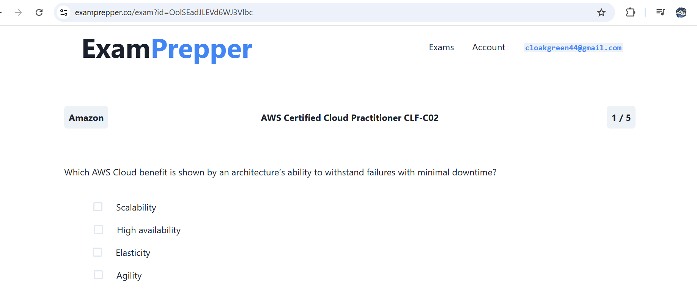

### Nguồn thứ 2 tôi luyện của anh `Ấn Độ` này cũng rất bao quát để yên tâm hơn.

`https://kananinirav.com/practice-exam/exams.html`
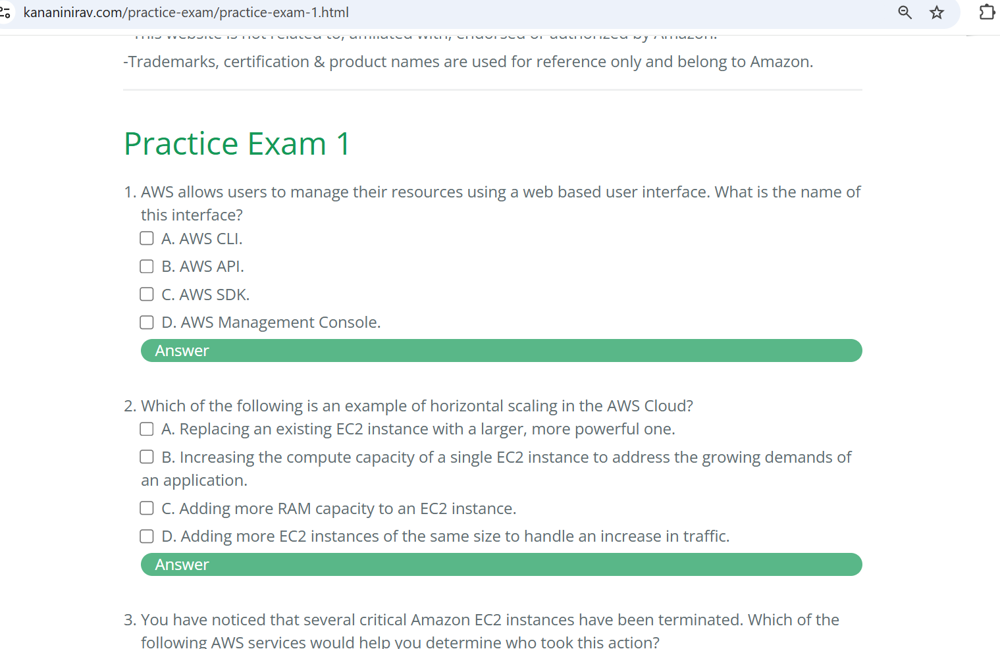

### Nguồn cuối cùng là mình luyện ở `YouTube`.

#### Kênh này cũng giúp bạn dư sức `pass` Cert, có điều đề ở đây hơi chi tiết hơn so với thực tế.

`https://youtu.be/yChiWUxP_2M?si=uB24Am43xq0v4SBv`
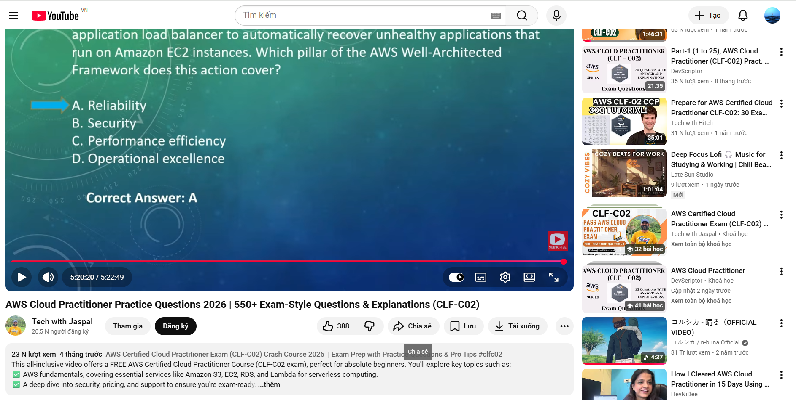

# 4. Quá trình đi thi

## 4.1 Lên kế hoạch

## Phải nói từ nhà tôi đến chỗ thi khá xa, tầm `28.5 km`.

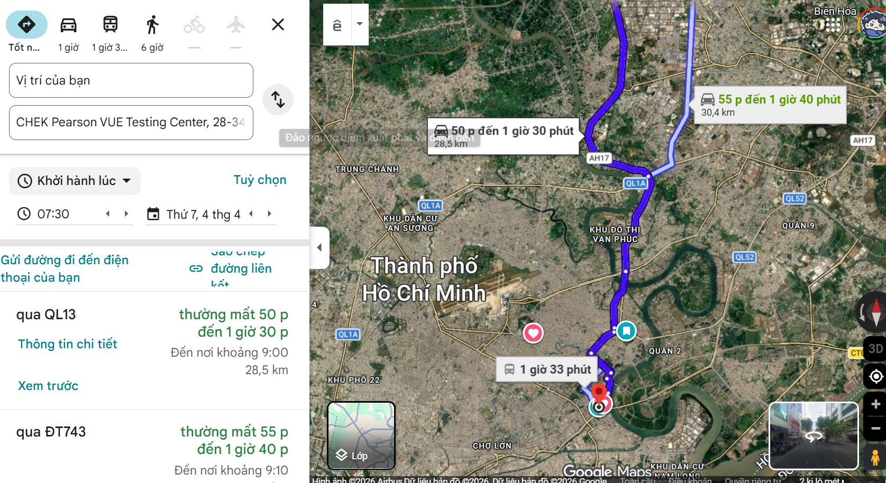

### Chỗ tôi đăng ký thi gần `Bitexco`. So với 2 lần trước đó lên `Bitexco`, tôi khá ngáo đường, phải dùng map vừa đi vừa xem rồi dừng lại kiểm tra, rất cực và kém tối ưu. Nhưng lần này tôi thay đổi cách tiếp cận: ngồi xem map ở nhà bằng `StreetView` rồi hình dung đường đi trước nhiều lần.

### Kết quả là tôi đi đến đấy (`Trung tâm khảo thí CHEK Pearson VUE Testing Center`) tính cả đi lẫn về tôi không xem map lần nào, mọi thứ đều như những gì tôi tưởng tượng từ khi ở nhà đến mọi con đường đi qua giống đến mức không nhầm vào đâu được. 😅

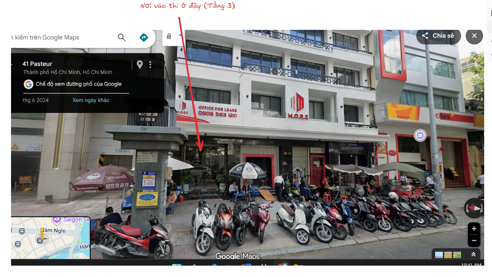

## 4.2 Review chỗ thi

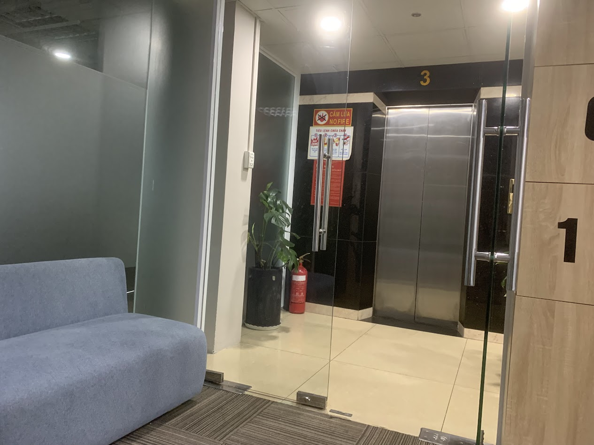
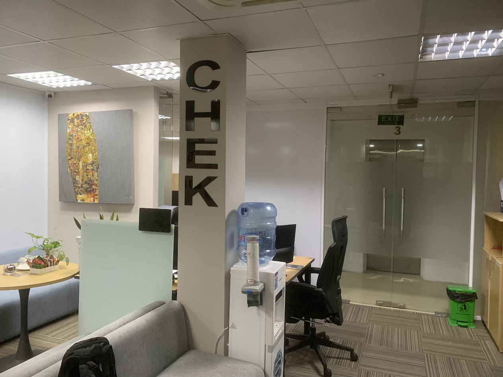

## Theo tôi đánh giá, chỗ thi này rất chuyên nghiệp và khá thoải mái. Người hướng dẫn cũng thân thiện nên tâm lý thi lần đầu của tôi đỡ căng thẳng hơn nhiều.

## Lần sau tôi sẽ đến đây để chinh phục vài Cert nữa nên có thể coi đây là Địa điểm thi ổn nhất tôi biết

## 4.3. Quy trình thi

### Bạn sẽ phải đưa `CCCD` bản cứng (tránh bản sao hay trên `VNeID`) để họ đối chiếu và kiểm tra, không cần giấy tờ gì thêm. Sau đó họ sẽ chụp một tấm hình chân dung bạn để làm minh chứng.

### Cuối cùng họ hỏi bạn có muốn vào thi luôn không dù lúc đó tôi chưa tới giờ thi (còn cách cả 1 tiếng) nên tôi muốn vào thi luôn.

### Khi vào thi, họ sẽ mở máy cho bạn trong phòng thi và hướng dẫn bạn đọc quy định rồi làm bài. Hôm đó tôi thi vào `thứ 7`, khá vắng, chỉ có vài người nên phòng rất yên tĩnh.😅

### Khi thi xong ra khỏi phòng họ sẽ nói bạn ký tên giấy tờ thủ tục thi xong, và `Chúc mừng bạn`. Nói thật cảm giác khi thi xong `pass` tôi vui sướng trong lòng phải kìm lại. ☺️

# 5. Đôi dòng `Trải nghiệm` và `cảm nhận` của tôi cả quá trình chinh phục Cert này (Bạn có thể bỏ qua):

### Cả 1 tháng trước đây tôi đã ấp ủ một kế hoạch dài để chinh phục các `Cert` và tôi biết rằng thời gian của mình không còn nhiều. Tôi tự tạo áp lực `FOMO` khá nặng để buộc bản thân phải làm tốt hơn, sống có ý nghĩa hơn. Trong `Journey` này, tôi chinh phục được `Cert` đầu tiên, và tôi rất vui ☺️. Có thể với người khác điều đó không quá lớn, nhưng với tôi, đó là cột mốc vượt qua `chính mình` của ngày hôm qua.

### Trong quá trình bắt đầu `Cert` đầu tiên này, tôi đối mặt với nhiều áp lực. Những đêm trước khi thi, tôi căng thẳng đến mức không ngủ được, dù bình thường đặt lưng xuống là ngủ luôn😴. Hành trình này mất `3 tuần` để học và luyện đề, nhưng tôi không thể dành trọn cả `3 tuần` cho nó vì còn project `Nghiên cứu khoa học`, đồ án ở trường, việc gia đình và hoạt động bên ngoài. Thời gian `thực sự` để học và ôn chắc chỉ hơn `1 tuần`.

### `Over Prepared` (chuẩn bị quá mức): Khi thi xong tôi mới nhận ra đề này dễ hơn tôi tưởng. Trước đó tôi luôn cảm thấy mình có thể `Fail` nên luyện đề gần như hết công suất vì sợ rớt; hầu như ngày nào trước khi thi tôi cũng `Stress`. Tôi rút ra bài học là không nên tưởng tượng quá mức một thứ gì đó quá khó trước khi nó xảy ra.

- Mà phải bình tĩnh, có sự chuẩn bị chắc chắn
- Có kế hoạch ôn tập rõ ràng, không nên quá `hối hả` vì nó chả được gì ngoài sự lo âu kéo dài không cần thiết
- Kỷ luật và sự điều độ là việc quan trọng nhất: thay vì lúc hứng thì học 3 tiếng, hãy học đều đặn 1-2 tiếng mỗi ngày, không cần cường độ quá cao.

### Tôi cần tiến lên phía trước nhiều hơn nữa còn nhiều thử thách tôi chưa khám phá hết được.

# 5. Lời cuối

- **Chứng chỉ này không quá khó:** Bạn chỉ cần học đều đặn trong 1 tuần rồi dành 1 tuần hoặc nhiều hơn để luyện đề là đủ để pass. Tránh dành quá nhiều thời gian học lý thuyết như tôi vì nó không tạo phản xạ làm đề tốt.
- **Bước đệm:** cho `Cert` tiếp theo như `SAA-C03`, một chứng chỉ tiềm năng lớn cho những ai theo `IT`, `AI`, ... thậm chí `Non-Tech` cũng học được.
- **Cuối cùng** là chúc bạn thi tốt cho kỳ thi sắp tới và cảm ơn bạn đã đọc qua bài viết dài lê thê này của mình!😅
