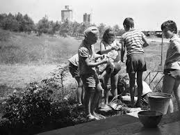
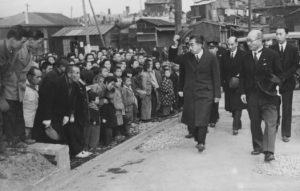
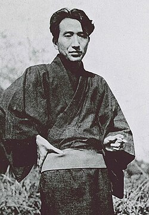

# Đôi điều về tác phẩm `Thất lạc cõi người`

## Giới thiệu tác phẩm

Tác phẩm `Thất lạc cõi người` hay còn gọi là Nhân gian thất cách của tác giả `Dazai Osamu` một người thuộc trường phái `vô lại`, từ `vô lại` ở đây nên hiểu nghĩa là những người chống lại những gì mà xã hội bấy giờ đang áp đặt hoặc phải tuân theo, họ đơn giản chỉ cảm thấy lạc lõng không tìm thấy điều họ muốn trong xã hội bấy giờ. Lối sống phóng đãng, rượu chè, phơi bày sự suy đồi và vô mục đích.

`Nhật bản` sau khi kết thúc chiến tranh thế giới thứ II bước vào thời kì chuyển giao, cũng vào lúc đó các nhà văn thế hệ mới cũng đối mặt với sự chuyển giao đó họ mất phương hướng và không tìm thấy mục đích sống.

## Đôi điều về cá nhân tôi nhìn nhận `Dazai`

Cái đầu tiên tôi nghĩ đến khi biết về ông này là càng đọc càng thấm sâu càng cảm thấy có nỗi buồn man mát mà ông ấy muốn hằn sâu vào người đọc, khi mà ở Nhật người thường không được xã hội cho phép được thể hiện con người thật ra ngoài mà phải đeo lớp mặt nạ (hay người `Việt` thường gọi là `thảo mai`). Từ truyền thống phải sống vì một tập thể chung bản thân `Dazai` cũng phải đeo một lớp mặt nạ như vậy mỗi ngày.

Ông ấy từng tự sát đến 5 lần và lần thứ 6 mới thành công vào năm `1948` nó xuất phát từ sự kết hợp nỗi đau tâm lý sâu sắc, sự bế tắc trong cuộc sống và tư tưởng văn học.

Nhìn bức hình chắc bạn cũng thấy được ông ấy có một nỗi buồn không thể tả được.

# 2. Cảm nhận sự trầm mặc, chấp nhận xã hội như nó vốn là

Sau khi đọc xong tác phẩm này với thói quen cũ sau khi nỗ lực cho một mục tiêu kéo dài mà một thứ khiến tôi ấn tượng là cả nguyên ngày đó người tôi cứ đơ ra, chả có tý cảm xúc gì với mọi thứ xung quanh vì chỉ nghĩ đến thứ đó.

Tôi cứ nghĩ đến sự đau đớn đến tột cùng của nhân vật `Yozo` của tác phẩm.

`Yozo` một nhân vật hướng nội, từ nhỏ đã có cảm giác sợ con người, sợ bị phán xét, chê trách, nên luôn đeo một lớp mặt nạ hề nhằm che đậy tâm hồn nhạy cảm của chính mình cho đến khi lớn lên theo học một trường đại học cậu ta bị một người bạn `horiki` lôi kéo trở nên sa đoạ, cậu ta tham gia tổ chức cộng sản(hội người đọc sách mac-xit bất hợp pháp), `yozo` tham gia hội này không phải vì muốn làm vì chính trị mà chỉ đơn thuần muốn thử cái cảm giác bất hợp pháp, cảm giác trái lệch với xã hội.

Bên cạnh đó đời `yozo` đã trải qua 3 người phụ nữ để lại dấu ấn lớn

- `Tsuneko` (cô gái ở quán bar): cô ấy là người phụ nữ đầu tiên mà `Yozo` thực sự cảm thấy có sự kết nối cả 2 đều chung một nỗi cô đơn và tuyệt vọng với cuộc sống dẫn đến cả 2 cùng tự sát đôi xuống biển ở `Kamakura`. Tuy nhiên chỉ `Tsuneko` chết, còn `Yozo` vẫn sống. Nó để lại vết séo tâm lý và tinh thần quá lớn cho cậu ta.

- `Shizuko` (Người mẹ đơn thân): cô ấy là người dịu dàng, tốt bụng, là người thực sự có thể giúp `Yozo` có một cuộc sống ổn định và hạnh phúc được. Tuy nhiên `Yozo` cảm thấy mình không xứng đáng với cô ấy và mỗi khi nhìn thấy cô ấy và con của cô ấy hạnh phúc cậu ấy luôn cảm thấy lạc lõng và coi mình là kẻ phá đám cuối cùng cậu ấy quyết định rời đi trong im lặng.

- `Yoshiko` (Người vợ ngây thơ): Cũng là người cuối cùng mà `Yozo` lấy làm vợ vì tính ngây thơ và cậu nghĩ là người trong sáng thuần khiết nhất. Có một câu nói mà `Yozo` đại ý rằng:
  `Nếu nói tài năng lớn nhất của Yoshiko là tài năng tin người tuyệt đối`
  Bi kịch thực sự đến khi nhờ vào cái tài năng trên mà cô bị một người lạ hãm hại ngay trong nhà mình. Nó làm sụp đổ niềm tin duy nhất của `Yozo` về sự trong sáng, vẻ đẹp thuần khiết. Kết cục cậu ta uống thuốc ngủ quá đà dẫn đến nhập viện.

Tóm lại cả 3 người phụ nữ bước qua đời `Yozo` đều có kết cục không mấy tốt đẹp nó vừa cho cậu ta một niềm hạnh phúc như một liều thuốc tức thời nhưng cũng để lại những vết sẹo in hằn theo suốt phần đời đau khỏ còn lại.

# 3. Chiếc mặt nạ hề

Đây là phần tôi suy nghĩ nhiều nhất khi đọc tác phẩm, có rất nhiều câu hỏi xuất hiện trong đàu tôi khi cứ nghĩ nó nhìn vào thực tại của mình thế nào qua lăng kính của `Yozo`.

Như tôi đã nói ở trên `Yozo` chỉ đeo mặt nạ vì không muốn bị coi là người không biết cách hoà nhập trong cuộc sống. Tôi lại tự hỏi: làm thế nào ta có thể vừa đeo lớp mặt nạ khi ở ngoài xã hội nơi công ty, xã giao, trường học, môi trường sống quanh tôi mà lại giữ được sự chân thật của chính mình trong đó.

Bạn biết đấy đây không phải điều dễ dàng nói ra bạn cũng thừa hiểu nếu ta dùng lớp mặt nạ quá dày thì đúng là ta rất mạnh mẽ ngoài kia đấy mọi người sẽ nghĩ ta hoà nhập, người vững chãi khó gì có thể làm ta sụp đổ được. Tuy nhiên nó cũng để lại cái gọi là chính ta bên trong bị nhấn chìm xuống vực thẳm sâu. Rồi cho đến khi lớp mặt nạ dày mà ta coi là không thể bị xuyên thủng một ngày nó tan vỡ thì thứ còn lại chỉ là cái tôi còn lại thì lúc đó ta sẽ như thế nào

Muốn được là chính mình nghe có vẻ đơn giản nhưng những ràng buộc của cuộc sống này đang trói buộc ta ví dụ xếp giao cho công việc A trên trời mà bạn chả hiểu gì nhưng bạn không thể nói em thích làm việc B hơn vì nó phù hợp với chuyên môn và kinh nghiệm hay sở thích của em được. Nghe có vẻ quen đúng không.

Ngay từ khi sinh ra hầu hết chúng ta đã bị ràng buộc ngay từ trong gia đình rồi nơi mà xã hội đã tạo ra luật ngầm mà ta không thể biết được. Khi còn nhỏ điều đầu tiên bạn cần làm không phải là cắm đầu vào mà ăn mà luôn nhắc là mời người lớn trước thậm chí là phải xếp thìa chén cho mọi người và để người lớn ăn trước dù bạn không muốn làm như thế. Cho đến khi ra ngoài xã hội bạn luôn phải cúi đầu trước xếp để ý họ thích ăn món nào uống gì, thói quen như nào rồi chuẩn bị cho họ, nhún nhường. Nói chung bạn không thể hoàn toàn làm theo ý mình được.

Thì `Yozo` trong tác phẩm cũng vậy nếu không nhờ mấy lớp mặt nạ trên thì số phận của cậu ta đã diễn ra sớm hơn ngay từ khi còn nhỏ rồi.

# 4. Nhìn vào thực tại

Bi kịch của `Yozo` khi diễn vai hề quá sâu đãn đến cậu ta quên mất mình là ai và không thể thành thật với chính mình được nữa dẫn đến hệ quả sống một cách thả trôi theo cuộc sống. Mặc kê mọi thứ ngoài kia.

Cái nỗi sợ hãi của `Yozo` hoàn toàn đúng như những gì người hiện đại ta gặp hiện nay ai cũng muốn là chính mình được làm điều mình muốn nhưng những quy tắc, tiền bạc, áp lực gia đình và xã hội không dễ dàng gì cho ta cái gọi là điều mình muốn hay là chính mình cả.

Bạn thấy đấy, đằng sau những `profile` của người ta trên `Facebook`, `Insta`, `LinkedIn` nhìn
rất hoành tráng, xịn sò, ngưỡng mộ, đáng mong ước nhìn trông có vẻ hoàn hảo, nhưng liệu họ có đang là chính mình không hay vì muốn để nhiều người biết đến nhằm tăng cái giá trị kinh tế và lợi ích cho bản thân họ bằng cách muốn ẩn đi phần thật bên trong họ sau những màn hình xã hội đó

Điều tôi học được là tôi vẫn cứ là chính mình làm điều tôi muốn, việc đeo mặt nạ là điều không thể tránh khỏi nhưng vẫn theo khuôn khổ của xã hội này nhưng không phải cái gì cũng theo hoàn toàn mà luôn đặt chính kiến của mình ra trước, thể hiện quan điểm đúng lúc như nước của `Lão tử` vậy đó thiên biến vạn hoá không quá cứng nhăc hay quá mềm dẻo.

Hành trình đi tìm ra điều tôi muốn có thể không hề đơn giản nhưng chắc chắn phải trải qua nhiều thứ gia vị đắng cay ngọt bùi thì cuộc sống mới thú vị được.

Một góc ban công quê tôi 2022 🫠🫠
