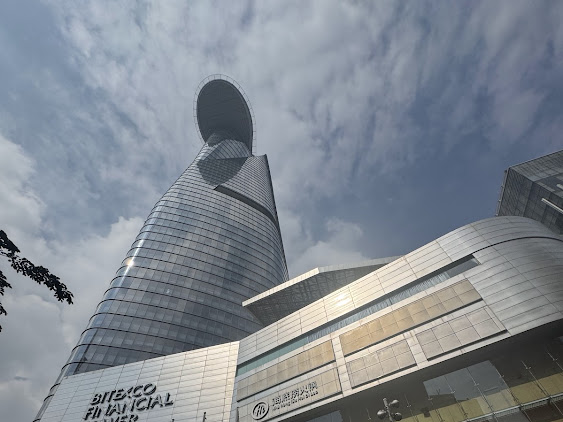
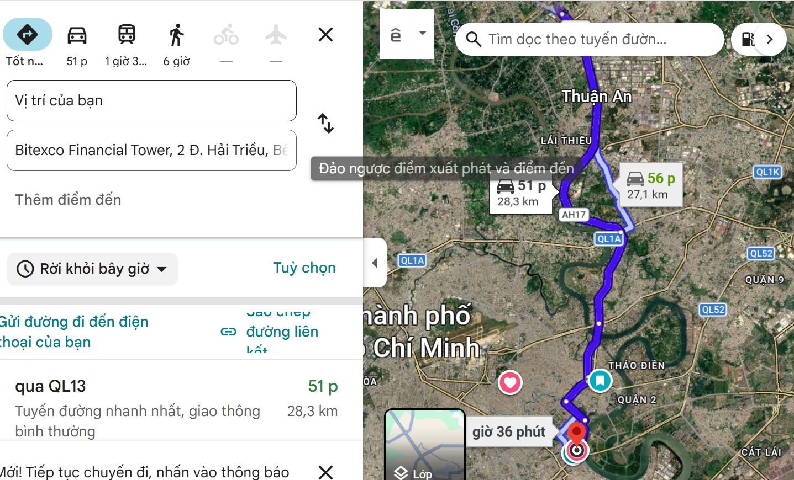
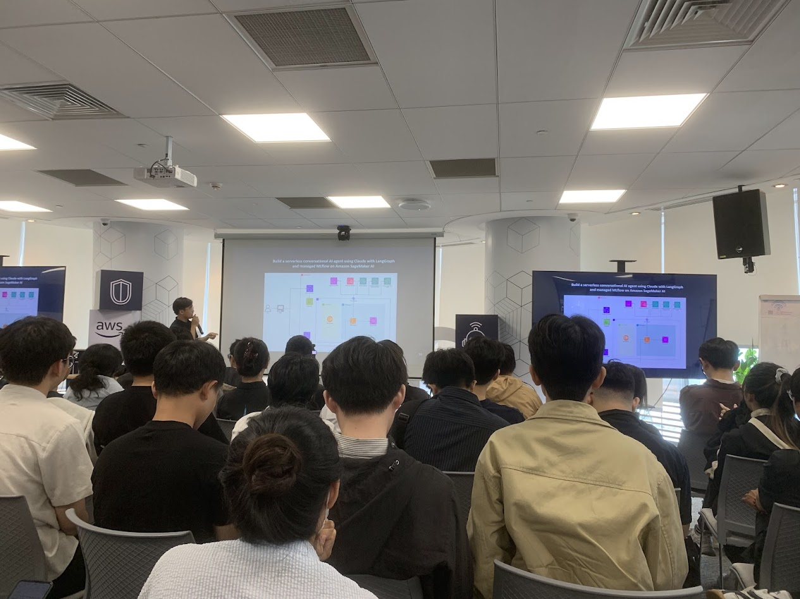
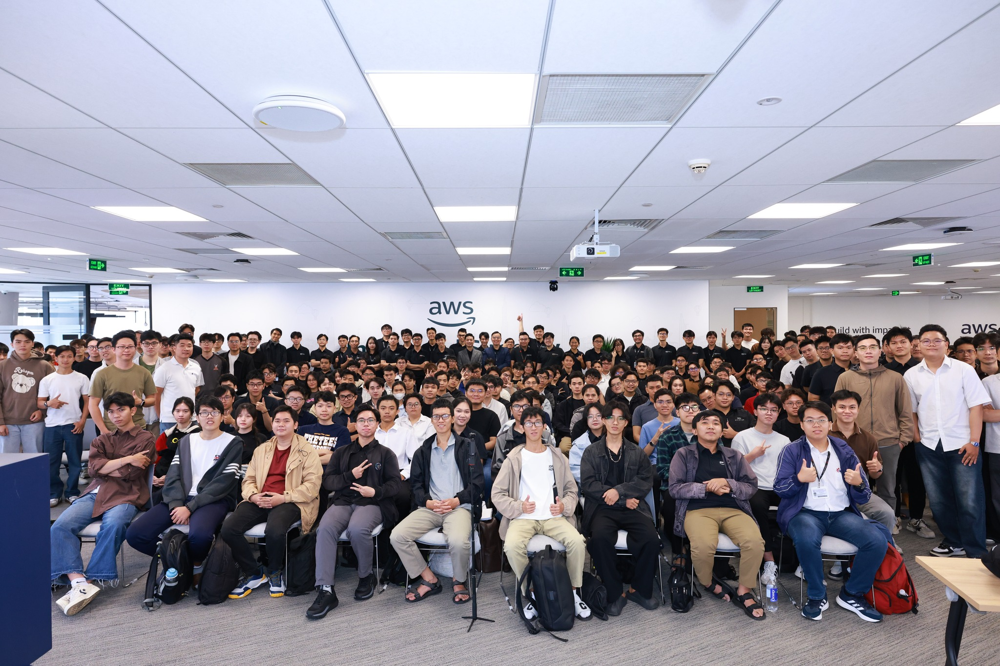

> **Lưu ý:** Bài viết dựa trên cảm nhận và trải nghiệm được đúc kết bởi hành trình của tác giả

## 1. Mở đầu không mong đợi

**Chào lại là tôi đây!**

_Đây là hành trình ngày `21/03/2026`_

vào nhiều ngày trước đó tôi thực sự là một con ếch ngồi đáy giếng :)), ngồi đắn đo suy nghĩ mình có nên đến FCAJ Community Day không

> **Lý do:**
>
> 1. `khoảng cách` vì từ nhà tôi đến Bitexco (nơi diễn ra `hội thảo` ở tầng 26), đến đó đi khá xa mất khoảng 1 tiếng, nắng nóng, kẹt xe,...blah blah
> 2. Nỗi sợ đến một nơi gặp toàn những `pro` đẳng cấp công nghệ trong khi mình hiện tại chỉ là thằng sinh viên IT quèn, nó khiến tôi khá tự ti
> 3. Ngày `21/03/2026` buổi sáng tôi có môn báo cáo cuối kỳ môn `Machine Learning` (học máy) và may thay tôi có phương án dự phòng, teammate gánh hết nên khá đỡ phần này, nhưng cái tôi của tôi lại dùng lý do có môn báo cáo này chỉ để biện minh nỗi sợ của mình

## 2. Sự thức tỉnh trong giấc ngủ

Vào đêm trước đó tôi thật sự khó ngủ và hầu như không thể ngủ được, cứ có việc quan trọng vào buổi sáng tiếp theo là tôi lại khó ngủ vào buổi tối, dù bình thường tôi rất dễ ngủ

.
.
.

Cứ nghĩ một lúc tự nhiên tôi lại tự nhắc mình phải đi, chắc chắn mai phải đi!

## 3. Sáng thức dậy

Tôi chuẩn bị mọi thứ hành trang và giao việc báo cáo cho teammate của tôi với sự tôn trọng

- 7h50 tôi bắt đầu xuất phát

- 8h54 tôi đến nơi và đậu xe

- 9h tôi lên tầng 26 và lắng nghe các `Speaker` trình bày các giải pháp và kiến trúc

> **Một vài hình ảnh tại sự kiện:**
>
> 

---

### Agenda (Lịch trình các track được trình bày)

☁️ **8:30 – 9:00 AM**
Check in at Floor 26

☁️ **09:00 - 09:45 AM**
**Building Modern Platform Engineering & Career Pathways**

- Discover company culture, internship opportunities, and how to engage with speakers through an interactive Q&A platform
- Get an introduction to Platform Engineering and its role in modern cloud and DevOps ecosystems
- Join an open Q&A session to ask questions and gain insights directly from industry experts

☁️ **09:45 - 10:15 AM**
**GenAIOps Essential - DevOps for Generative AI Applications**

- DevOps Fundamentals on AWS and Learning Resources
- Examples GenAIOps for Real AWS Projects with Bedrock AgentCore Observability, EKS, Langfuse.

☁️ **10:15 – 10:45 AM**
**Shipping Code in the Agentic Era**

- The problem | The Tools | Deep Dive
- Productivity Playbook | Demo

☕️ **10:45 - 11:00 AM**
**Break**

☁️ **11:00 – 11:30 AM**
**Production-Grade Multimodal GenAI on AWS**

- The New AI Application Stack
- Multimodal Search with Nova Embeddings
- GraphRAG for Enterprise Knowledge
- Multi-Agent Workflows
- Safe & Observable GenAI

☁️ **11:30 - 12:00 PM**
**From Edge To Origin: CloudFront as Your Foundation**

- Amazon CloudFront for every workload
- Cost optimization with Amazon CloudFront
- Security capabilities
- Enhanced reliability with Amazon CloudFront
- Enhanced performance with Amazon CloudFront

---

## Bài học rút ra

_Bước ra khỏi vùng an toàn là cách tiến bộ nhanh nhất_
Tôi có nghe anh `Hưng`, một `Solution Architect`, truyền đầy cảm hứng cho tôi

**1. Đầu tiên là:** Khi muốn để doanh nghiệp hay khách hàng hay bất kì công ty nào tuyển mình vào thì mình phải cho họ thấy cái sản phẩm mình làm ra nó giải quyết được cái vấn đề gì của doanh nghiệp

**2. Thứ hai là:** khi mà AI ngày càng mạnh về technical và trong một dev team mà ai cũng có cái `technical` như nhau, vậy vấn đề năng lực khác nhau ở chỗ nào -> Anh `Hưng` mới nói một điều mà tôi đã nghe nhiều lần từ ba tôi là `soft skill` là các kỹ năng về con người như giao tiếp, thấu hiểu, kết nối với những người khác, cởi mở, chủ động, mạnh dạn, phải biết phối hợp với người khác để cùng giải quyết vấn đề

**3. Thứ ba là:** biết 100 cái `Tools` khác nhau cũng không quan trọng, mà cái quan trọng là phải hiểu rõ bản chất, cái nền tảng cơ bản nhất

Ví dụ khi AWS EKS gặp lỗi thì cần phải `troubleshooting` nó, nhưng để `troubleshooting` được thì phải nắm chắc thằng `kubernetes` bởi vì công cụ nào đi nữa nó cũng quy về một cái kiến thức căn bản nhất
-> Cho nên khi hệ thống AWS gặp vấn đề, những kiến thức liên quan đến `cloud computing`, `networking`, `OS` phải nắm cực chắc thay vì học cách sử dụng 100 `Tools` khác nhau, và cái khả năng `troubleshooting`, `debugging` là quan trọng nhất

**4. Vấn đề không phải là học code hay không mà học có nắm chắc cái code hay không**
-> Bởi vì khi giải `leetcode` cũng chỉ giúp `pass Interview` nhưng không giải quyết được `nỗi đau` của khách hàng, doanh nghiệp thì code đến mấy cũng vô dụng

Backend hay AI Engineer, bản chất AI engineer cũng từ Backend mà ra; bây giờ doanh nghiệp đòi hỏi kỹ năng đa dạng chứ không chỉ từng lĩnh vực như hồi xưa (chú ý `data platform cho devops nếu chỉ biết mỗi devops thì không thể làm được gì`)

**5. Thời gian là `Dầu mỏ` 🫠, Tiếng Anh là quan trọng**
Chú trọng thời gian khi còn là sinh viên bởi vì khi đi làm chủ yếu ta dựa trên kiến thức nền tảng ở đại học và ta sẽ không có nhiều thời gian để học (`deadline` dí ngập đầu, `kpi`,...blah blah...)

**6. Một vấn đề nữa là cái hơn thua nhau nhiều người ở chỗ tôi mới nhận ra là `Mindset` (Tư duy)** là cái cách mà người đó suy nghĩ hằng ngày, dám đương đầu với thử thách, sẵn sàng học hỏi từ bất kỳ ai giỏi hơn mình bất kể tuổi tác, hạ cái tôi xuống là điều quan trọng căn bản nhất và ngừng so sánh với người khác

Điều này làm tôi nhớ đến bài học của `Lão Tử` (một triết gia phương Đông) là:

> Suy nghĩ tạo nên Hành động
>
> Hành động tạo nên Thói Quen
>
> Thói quen tạo nên Tính cách
>
> Và Tính cách Hình thành nên Số phận
