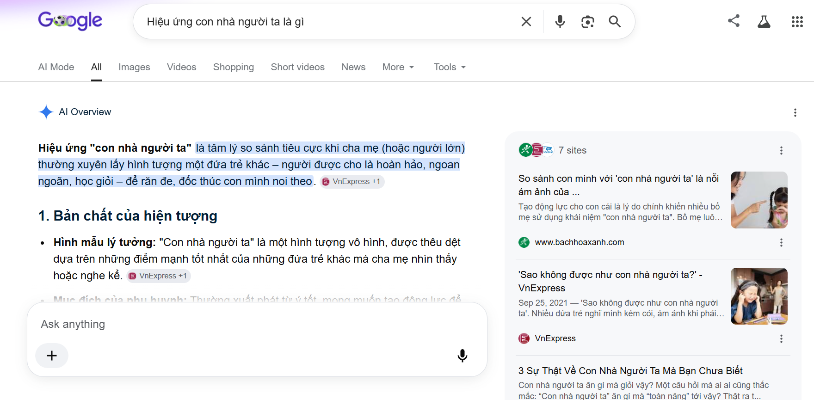
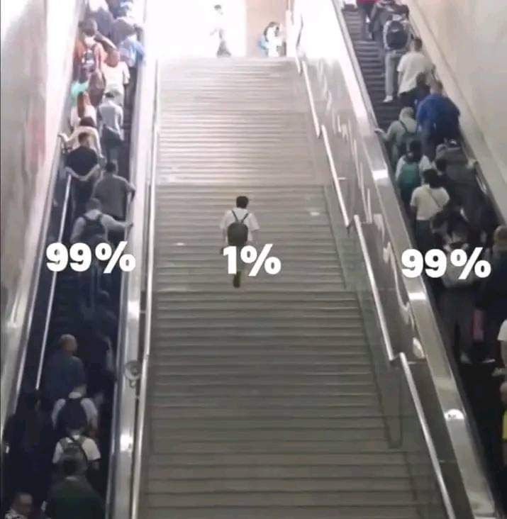

# Sự thật mà phần lớn mọi người thường bỏ qua

Xin chào, lại là tôi đây!

Đã một tuần trôi qua kể từ bài viết tuần trước, đáng lẽ tôi nên viết hai bài một tuần. Tuy nhiên, do tính chất công việc nên bây giờ tôi mới rảnh để viết bài này, xuất phát từ một ý tưởng thôi thúc khiến tôi muốn chia sẻ đến bạn ngay lập tức.

Chủ đề lần này khá phổ biến trong đời sống, bạn có thể bắt gặp nó ở khắp mọi nơi — dù là vô hình hay hữu hình, nó vẫn luôn âm thầm xuất hiện.

## 1. Sự trói buộc nhận thức trong việc so sánh

Gần như hàng ngày bạn sẽ thấy nó xuất hiện nhan nhản khắp nơi: từ công sở, phố xá, mạng xã hội cho đến chính gia đình bạn. Chắc hẳn bạn đã quá quen thuộc với câu nói `“con nhà người ta”` trong mỗi bữa ăn, khi đài truyền hình đưa tin về một cá nhân xuất sắc đạt thành tích đột phá vượt lên gia cảnh khó khăn.

Đúng, tôi thừa nhận những cá nhân xuất sắc như vậy rất đáng ngưỡng mộ và học hỏi. Tuy nhiên, chủ đề chúng ta bàn đến ngày hôm nay không phải là cách để trở nên giỏi giang như họ, mà là về **nhận thức hằng ngày của chúng ta đối với việc so sánh** — về mặt lợi và hại, và liệu đó là sự lựa chọn chủ động hay điều ép buộc chúng ta mỗi ngày.

Với chủ đề này, mọi chuyện sẽ không chỉ dừng lại ở bề nổi như những tin tức trên truyền hình hay mạng xã hội. Tôi muốn chia sẻ từ quan điểm cá nhân, trải nghiệm sống, sự quan sát hành vi con người hàng ngày và lồng ghép nền tảng triết học phương Đông lẫn phương Tây để lý giải các hành vi này.

Có thể bạn tự hỏi việc tôi viết bài chia sẻ như thế này để làm gì? Liệu nó có vô ích lắm không khi trong thời đại này, `AI` đã làm được hầu hết mọi thứ và đưa ra câu trả lời ngay lập tức? Người dùng chẳng cần phải mò vào các trang web, blog để tìm câu trả lời nữa. Bạn có thể thấy `Google` đang "thay máu" toàn bộ kết quả tìm kiếm bằng `AI Overview`. Nó tóm gọn câu trả lời tổng hợp từ nhiều trang web, khiến người dùng không còn nhu cầu mở từng trang ra đọc nữa.

Tuy nhiên, vấn đề không chỉ nằm ở câu trả lời nhanh gọn hay việc tiết kiệm thời gian. Tôi tin rằng mọi thứ trên thế giới đều có tính **đánh đổi (`trade-off`)**. Tốc độ và sự tối ưu nếu thiếu đi sự trải nghiệm, quan sát và đánh giá đa góc độ sẽ vô tình làm bộ não của chúng ta thụ động đi chứ không tốt lên. Với cá nhân tôi, khi tìm kiếm một vấn đề, tôi vẫn thích tham khảo qua các trang web để xem tác giả viết gì, lập luận và trích dẫn ra sao. Nói vậy không đồng nghĩa với việc tôi cổ hủ, từ bỏ những tiện nghi tối ưu mà `AI` mang lại.

Tôi vẫn sử dụng `AI Overview` để tổng hợp thông tin khi thời gian gấp rút không thể đọc hết mọi thứ. Ý tôi muốn nói ở đây là chúng ta nên kết hợp cả hai: dùng `AI` để có cái nhìn tổng quan nhanh chóng, và đọc các trang web thực tế để hiểu sâu sắc góc nhìn của tác giả, từ đó suy ngẫm có chiều sâu hơn.

### 1.1. Cách nhận biết các triệu chứng so sánh hơn thua

Tôi đã từng đặt vấn đề này với nhiều người bạn của mình. Một vài người trong số họ không bận tâm đến việc hơn thua hay so sánh, họ chỉ đơn giản muốn sống một cuộc đời bình yên và an nhàn. Vì vậy, họ sẽ không nằm trong phạm vi thảo luận của bài viết này.

**Triệu chứng đầu tiên:** Khi bạn nhìn thấy ai đó trên mạng xã hội hoặc bạn bè xung quanh sở hữu nhà lầu, xe hơi, có được những món đồ bạn hằng ao ước, có người yêu đẹp, hay đơn giản là bạn thấy họ giỏi giang vượt trội hơn mình (trong khi trước đây họ có xuất phát điểm kém hơn bạn). 

Nhức nhối nhất hiện nay chính là trào lưu **`"Flexing"`** và áp lực đồng trang lứa (**`Peer Pressure`**) đang càn quét các nền tảng mạng xã hội, đặc biệt là `Threads` hay `TikTok`. Chỉ cần lướt vài phút, đập vào mắt bạn sẽ là hàng loạt bài chia sẻ kiểu: *"20 tuổi tự mua nhà Quận 1"*, *"sinh viên năm hai thu nhập 9 chữ số"*, hay *"sở hữu profile khủng khi chưa ra trường"*... Thuật toán liên tục nhồi nhét những nội dung này vào tâm trí chúng ta, tạo ra một ảo tưởng độc hại rằng: **Tất cả mọi người đều đang thành công vượt trội, ngoại trừ bạn.** 

Thực tế nhức nhối là để chạy theo cái mác "thành công" ảo đó, không ít người trẻ đã tự nguyện rơi vào cái bẫy **tiêu dùng giả tạo**: đi vay nợ để mua sắm những món đồ hiệu xa xỉ, check-in ở những quán cà phê sang chảnh chỉ để chụp ảnh, cố đắp lên mình vẻ ngoài hào nhoáng để không bị coi là "tụt hậu". Họ đang tiêu những đồng tiền mình chưa kiếm được, để mua những thứ mình không thực sự cần, nhằm gây ấn tượng với những người họ thậm chí chẳng hề thích. 

Những phản ứng cảm xúc phức tạp nảy sinh lúc này vốn dĩ đã được ghi lại trong mã gen di truyền từ thời cổ đại để sinh tồn trong các bộ tộc.

Và chắc chắn, bạn sẽ nảy sinh cảm giác bồn chồn, lo lắng, khó chịu và ghen tỵ. Bản thân tôi trước đây cũng từng trải qua cảm xúc này rất nhiều lần. Tôi vốn là một người **hiếu thắng** từ thời cấp 3, từng có tham vọng phải giỏi nhất lớp, rồi đặt mục tiêu giỏi nhất trường, sau đó là muốn cạnh tranh với các trường chuyên lớp chọn khác chỉ vì trường tôi học khi ấy bị coi là kém nhất tỉnh. Rốt cuộc, nỗ lực hết sức tôi cũng chỉ nằm trong top giỏi của lớp mà thôi.

Lên đến đại học, cảm giác muốn vượt trội hơn người khác trong tôi lại càng mạnh mẽ hơn. Bất cứ khi nào thấy ai đó giỏi hơn, hoặc một người mình từng coi là kém hơn lại làm tốt hơn mình, cảm xúc của tôi lập tức hỗn loạn. Nồng độ `cortisol` (hormone căng thẳng) tiết ra nhiều hơn khiến tư duy của tôi bị lu mờ và không thể đưa ra những quyết định sáng suốt.

Đây có thể coi là một kiểu **tư duy tuyến tính sai lầm**. Giờ đây khi sắp ra trường, có thể ngồi viết lại những dòng này là một điều may mắn đối với tôi. Sau này khi đi làm bận rộn không còn nhiều thời gian nữa, tôi vẫn có thể nhìn lại tuổi trẻ của mình xem bản thân đã để lại dấu ấn gì trong cuộc đời.

Kiểu **suy nghĩ tuyến tính** này là một cơ chế phổ biến đang âm thầm vận hành trong cuộc sống. Hãy nghĩ đơn giản thế này: khi nghe tin một người bạn đạt giải thưởng lớn hoặc kiếm được một công việc rất tốt, điều đầu tiên xuất hiện trong suy nghĩ của đa số mọi người (khi chưa làm được như họ) chính là cảm giác hơn thua. Tôi không hề nói vẩn vơ điều này.

Bản chất cuộc sống này luôn cần sự cạnh tranh để phát triển, nên hầu như không ai tránh khỏi suy nghĩ hơn thua, khác biệt chỉ là ở cách mỗi người nhìn nhận nó. Vì vậy, việc cha mẹ bảo con cái phải giỏi hơn bạn bè, hay việc xã hội luôn đòi hỏi chúng ta phải vượt trội hơn người khác là điều tất yếu. Chúng ta thấy nó trong các kỳ thi đại học khốc liệt `` `1 chọi 100` ``, trong sự cạnh tranh giữa các nhân viên trong công ty, hay việc các cầu thủ tranh giành một `suất đá chính` để mở ra cơ hội sự nghiệp. Nhìn theo hướng tích cực thì đó là động lực phát triển, nhưng nó cũng vô tình tạo ra một áp lực khổng lồ, khiến ta dễ quên đi mục đích ban đầu: **phát triển bản thân theo cách tự nhiên** thay vì mãi bận tâm xem mình đang hơn hay kém người khác thế nào.

### 1.2. Cái giá phải trả

Và tất nhiên, **cái giá phải trả cho điều đó là quá lớn**. Khi bạn lấy thước đo của người khác làm tiêu chuẩn cho cuộc đời mình, bạn đã tự nguyện giao quyền kiểm soát hạnh phúc cá nhân vào tay xã hội. 

Bản thân tôi, như đã kể ở trên, luôn tự đặt lên vai áp lực không cần thiết phải giỏi hơn người khác và nỗi sợ bị vượt mặt. Nó giống như một cơn ác mộng đeo bám tôi mỗi tối, khiến tôi không tài nào chợp mắt nổi. Bạn không chỉ kiệt quệ về mặt sức khỏe tinh thần (`mental health`), mà bộ não lúc nào cũng trong trạng thái phòng vệ và căng thẳng tột độ. Đó không phải là sự phát triển lành mạnh, đó là hành trình tự hủy hoại bản thân trong im lặng.

## 2. Sự bừng tỉnh

Để thoát khỏi sự trói buộc vô hình đó, tôi nhận ra ba sự thật cốt lõi:

*   **Sự đa dạng của môi trường:** Bạn có thể thấy mỗi người đều có môi trường sống, cách giáo dục, điều kiện xuất phát và lối tư duy hàng ngày hoàn toàn khác nhau. Cho nên, sự khác biệt trong cách nhìn nhận cuộc sống giữa người với người là điều tất yếu.
*   **Sự độc lập của mục tiêu cá nhân:** Việc người khác đạt được mục tiêu của họ thực chất không liên quan gì đến mục tiêu của bạn. Khi bạn tự hỏi tại sao họ đạt giải này giải kia, được tôn vinh, ngưỡng mộ còn mình thì không, hãy nhớ rằng mục tiêu của bạn khác họ. Thành công của họ không đồng nghĩa với việc đó là cái đích mà bạn bắt buộc phải hướng tới. Đây là một cái bẫy tư duy điển hình mà chính tôi và nhiều bạn trẻ vẫn thường vô tình vướng phải.
*   **Tính chủ quan từ các định danh xã hội:** Việc xã hội định danh người này thành công hay người kia kém cỏi chỉ là những nhận định mang tính chủ quan. Bản thân sự đánh giá và phán xét từ bên ngoài không bao giờ có thể định vị giá trị của một con người nếu không xem xét qua các yếu tố nội tại mà tôi đã đề cập ở trên.

## 3. Cuộc sống là những sự lựa chọn

*   **Những người chọn xuất sắc và thành công:** Đây là một sự lựa chọn. Không ai ép bạn phải thành công hay phải trở nên xuất sắc cả. Với những người chọn con đường xuất sắc, đó là quyết định của họ và họ chấp nhận đánh đổi bằng việc chịu áp lực cao, sự ganh ghét, đố kỵ từ người khác, thậm chí là những tác nhân muốn hạ thấp họ khi có cơ hội. Họ phải làm việc tăng ca, đảm nhận những nhiệm vụ khó khăn bất kể ngày đêm, tìm mọi cách để tiến bộ hơn mỗi ngày. Họ sẵn sàng đập vỡ cái tôi cũ kỹ, từ bỏ những lối tư duy sai lầm để tiếp nhận cái mới, dù điều đó chưa bao giờ là dễ dàng. Tóm lại, họ sẽ sống mệt mỏi hơn những người khác, nhưng đích đến cuối cùng chắc chắn sẽ khiến họ mỉm cười tự hào vì những nỗ lực đã bỏ ra.
*   **Những người chọn an nhàn và bình yên:** Đây hoàn toàn không phải là sự kém cỏi, thất bại hay yếu thế. Xã hội thường có cái nhìn định kiến rằng những người chọn cuộc sống bình lặng, an nhàn là thiếu năng nổ, từ đó đánh giá thấp họ và không mấy khi tôn vinh lựa chọn này. Tuy nhiên, họ chỉ đơn giản là có một lựa chọn khác. Có thể bản thân họ cũng là những người rất giỏi, rất xuất sắc, nhưng sau khi cân nhắc những áp lực phải đánh đổi, họ chọn cuộc sống bình yên thay vì lao vào những cuộc cạnh tranh đấu đá ngoài xã hội. Đó hoàn toàn là một lựa chọn hợp lý.

Chốt lại, vấn đề không nằm ở việc bạn chọn thăng tiến chịu áp lực lớn hay chọn an nhàn bình yên, mà cốt lõi nằm ở **sự chủ động lựa chọn** của bạn. Nếu bạn thích thử thách, muốn bản thân tiến bộ và đạt được thành công lớn, bạn chọn con đường thứ nhất. Nếu bạn thích sự bình yên và sống tự tại, bạn chọn con đường thứ hai. Tất nhiên, con đường thứ hai thường được đa số mọi người lựa chọn hơn, vì rất ít người chịu được áp lực cao để đi theo con đường `1%` đầy thử thách.

## 4. Bảng ghi chú các bài học chính

| **Chủ đề** | **Đúc kết cốt lõi** | **Bản chất thực dụng & Hành động** |
| :--- | :--- | :--- |
| **Bẫy so sánh hơn thua** | "Sự so sánh là phản ứng cảm xúc phức tạp được ghi lại trong mã gen di truyền từ thời cổ đại để sinh tồn." | Thừa nhận ghen tỵ là bản năng, nhưng cần kiểm soát hormone căng thẳng (`cortisol`) để không lu mờ quyết định sáng suốt. |
| **Công nghệ & Trải nghiệm** | "Tốc độ và sự tối ưu nếu thiếu đi sự trải nghiệm, quan sát và đánh giá đa góc độ sẽ vô tình làm bộ não của chúng ta thụ động đi." | Dùng `AI` để tổng hợp nhanh, nhưng phải đọc sâu và tự suy ngẫm để rèn luyện tư duy hệ thống độc lập. |
| **Độc lập mục tiêu** | "Thành công của người khác không đồng nghĩa với việc đó là cái đích mà bạn bắt buộc phải hướng tới." | Vượt qua bẫy tư duy tuyến tính. Giá trị một con người được đo bằng các yếu tố nội tại chứ không phải định danh chủ quan từ xã hội. |
| **Lựa chọn & Đánh đổi** | "Vấn đề không nằm ở việc chọn thăng tiến chịu áp lực hay an nhàn bình yên, mà cốt lõi nằm ở sự chủ động lựa chọn của bạn." | Con đường `1%` (Xuất sắc) hay con đường bình lặng (An nhàn) đều có cái giá của nó. Chọn là phải dám chấp nhận **đánh đổi (`trade-off`)**. |