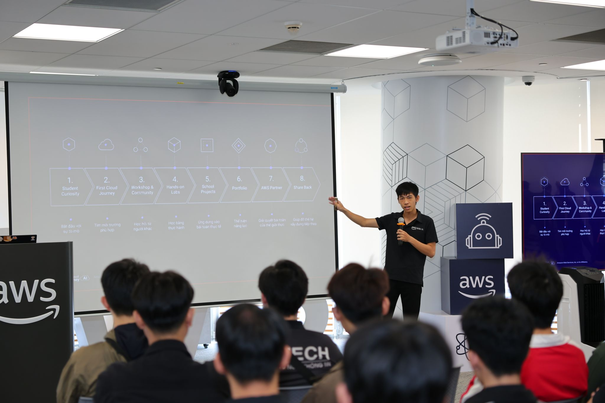
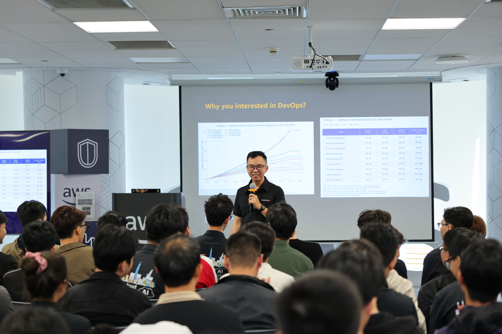
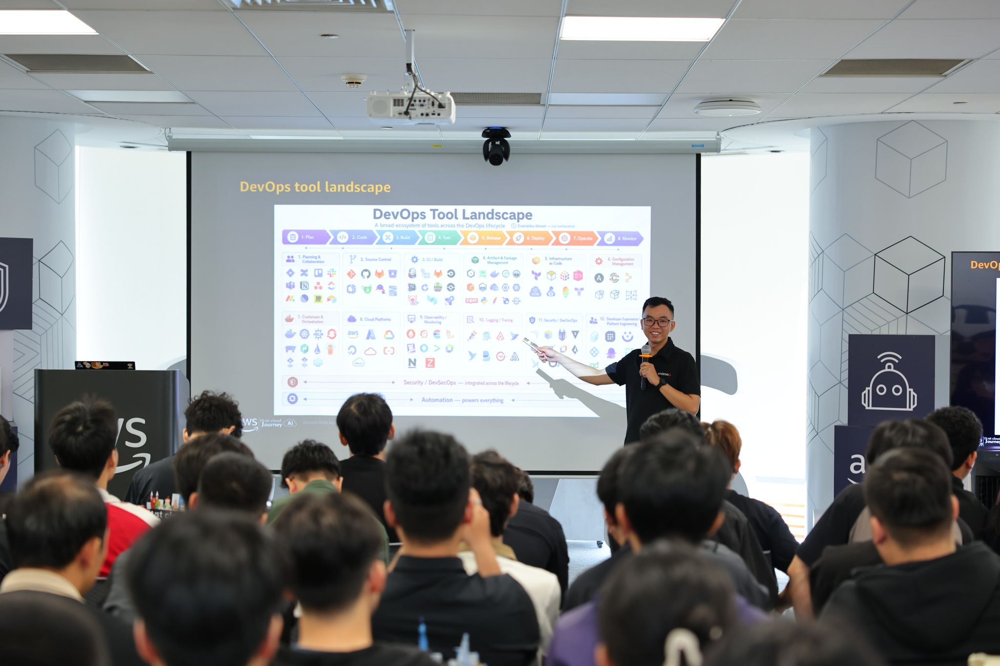
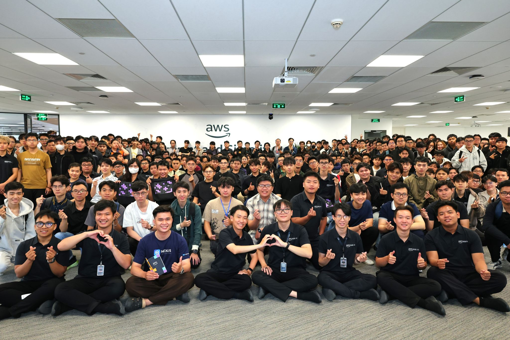

# Sự thật về DevOps không như tôi nghĩ

## 1. Mở đầu

Không khí ở buổi meetup `FCAJ (First Cloud AI Journey)` lần nào cũng khiến tôi có một tâm thế phấn khởi bởi sự đông đảo của các bạn trẻ cũng như tôi. Trước sự đông đảo đó, tôi thấy ai cũng tràn đầy khí thế và cảm thấy lượng kiến thức cùng sức trẻ ở đây khiến tôi cũng bị lây theo cái năng lượng học hỏi đó.

Có 5 `session` ở buổi meetup và tôi đặc biệt ấn tượng với phần mở đầu của một tài năng trẻ 2k5 là `Nghi Danh Hoàng Hiếu`. Cậu ấy đã đưa ra góc nhìn rất thực tế từ kinh nghiệm 2 năm tham gia `FCAJ`, từ đó tôi học được rất nhiều điều từ thanh niên này.

Điểm đặc biệt trong session của Hiếu là cậu ấy nhấn mạnh `DevOps` không chỉ là học hay đơn thuần sử dụng `tool`, mà là ở `tư duy`, `trách nhiệm` và `cách phát triển` trong kỷ nguyên `AI Agent`. Cụ thể, cậu ấy nhấn mạnh ở chỗ những buổi meetup như thế này, điều quan trọng nhất là làm thế nào để kết nối, trao đổi `LinkedIn` với các anh chị đi trước mới là thứ quý giá nhất.

Nhưng bài viết này tôi muốn tập trung nhiều hơn vào phần chia sẻ của anh `Trọng Trương` (`DevOps Engineer` tại `Endava`).

## 2. Những kỳ vọng trong mơ tưởng không như thực tế

Anh ấy bắt đầu phần trình bày của mình rất đơn giản: "Ai trong số các bạn ở đây muốn làm `DevOps Engineer`?". Lúc đó cũng chỉ lác đác vài cánh tay giơ lên.
Anh lại hỏi tiếp: "Ai trong số các bạn muốn làm `Platform Engineer`?". Lúc này thì cánh tay giơ lên lại càng ít hơn.

Và khi anh đặt câu hỏi: "Vậy tại sao các bạn lại muốn theo `DevOps` mà không phải những lĩnh vực khác?", một số bạn trả lời là vì `lương cao`. Điều này không quá bất ngờ, bởi vì trong biểu đồ anh trình bày, `DevOps` những năm gần đây mức lương không tăng nhiều, thậm chí còn thấp hơn `Cybersecurity`, trong khi `AI Engineer` thì lại tăng cao dần với mức lương thuộc hàng top.

Khi câu hỏi đặt ra không hẳn là vì lương, mọi người bắt đầu im lặng. Ngay cả bản thân tôi, một người muốn theo đuổi `DevOps`, khi bị hỏi "tại sao" cũng bỗng lúng túng. Trước đó, tôi cứ ao ước được làm công việc này, cứ bắt tay vào nghiên cứu `DevOps` nhưng lại quên mất một điều: tại sao mình lại chọn nó? Từ câu hỏi đó, tôi bắt đầu tự suy nghĩ lại. Nếu không hẳn vì lương, thì có lẽ chắc là do tôi `thích DevOps` thôi. So với các lĩnh vực khác như `AI Engineer` hay `Fullstack`, tôi không cảm thấy vui khi làm bằng, trong khi với `DevOps`, tôi lại tìm thấy niềm vui thực sự khi tự mình cấu hình và làm cho hệ thống được tự động hóa.

`DevOps` là lĩnh vực nằm ở giữa `Dev` và `Ops`, cho nên bạn phải biết cả hai. Và `DevOps` cũng đồng thời là người nắm giữ nhiều "quyền lực" nhất trong team.

Anh Trọng có nói một câu rất thấm: "Quyền lực càng cao, trách nhiệm càng lớn và đôi khi đi kèm rất nhiều đau đầu."

Một điểm tôi đặc biệt lưu ý là khi anh nói đôi lúc phải trực server (`on-call`) liên tục trong một thời gian dài, các team phải thay ca cho nhau. Việc này thực sự rất mất sức và mệt mỏi.

## 3. Những gì học ở giảng đường không đồng nghĩa với thực tế

Những gì được học ở trường chủ yếu là `lý thuyết`, những bài `lab` hay đồ án nhỏ. Nó chưa thể khẳng định bạn đủ kỹ năng để ra ngoài làm việc thực tế cho các công ty. Vận hành một hệ thống thực tế đòi hỏi nhiều hơn thế: kỹ năng chuyên môn kỹ thuật tốt, khả năng `troubleshooting` (sửa lỗi) kịp thời và giải quyết vấn đề hiệu quả.

Anh chia sẻ rằng bản thân anh cũng từng có vài lần làm lỗi hệ thống (gây ra `Incident`), và bài học anh rút ra là tư duy dám chịu trách nhiệm (`ownership`).

## 4. DevOps thời kỳ AI (Góc nhìn 2026+)

Chúng ta đang ở năm 2026, thời kỳ mà `AI` và các `AI Agent` đang phát triển cực kỳ mạnh mẽ. Chúng có thể viết script `Terraform` chỉ trong vài giây, cấu hình pipeline `CI/CD` trong một nốt nhạc, code ra cả hệ thống chỉ trong vài phút. Vậy thì vấn đề đặt ra: Giá trị của một kỹ sư `DevOps` nằm ở đâu?

Việc cạnh tranh là điều bắt buộc xảy ra và chắc chắn nó khốc liệt hơn, nhưng cơ hội chỉ dành cho những ai biết điều này sớm hơn.

### 4.1. Tư duy hệ thống (System Thinking)

`AI` có thể viết code nhanh hơn bạn, viết chính xác và đẹp hơn bạn, nhưng nó không thể hiểu sâu sắc nghiệp vụ giữa con người với con người khi vận hành hệ thống. Nó không nắm được cấu trúc đặc thù của doanh nghiệp, không thể tự kết nối với các phòng ban khác nhau để giải quyết vấn đề cho từng người. Và đặc biệt quan trọng, `AI` không biết `trade-off` (đánh đổi) giữa hiệu năng và chi phí lúc nào là tốt nhất.

### 4.2. Văn hóa DevOps (DevOps Culture)

`DevOps` không phải là một chức danh và cũng không chỉ là một nghề kỹ thuật chỉ biết dùng `tool`, mà nó còn là `văn hóa làm việc` và `sự cộng tác`. `AI` không thể kết nối con người với nhau để làm việc. Nó không thể giao tiếp và giải quyết xung đột giữa team `Dev` (muốn deploy nhanh) và team `Ops` (muốn hệ thống ổn định). Chìa khóa ở đây nằm ở việc `giao tiếp và thấu hiểu` lẫn nhau giữa con người với con người.

## 5. Lời khuyên cho những người muốn theo DevOps, Intern hay Fresher

Bản thân tôi cũng đang tự làm các dự án sử dụng các tool này, cày cuốc `Docker`, `Kubernetes`, `ArgoCD`, `Ansible`, `Terraform`... Nhưng nếu chỉ nói đến việc dùng `tool` thì ai làm chẳng được.

Nếu bạn cũng đang ở trong hoàn cảnh giống tôi:

- **Đừng chạy theo công cụ**: Việc thành thạo các tool `DevOps` là điều gần như bắt buộc. Tuy nhiên, nếu chỉ chạy theo công cụ mà không hiểu `First Principle` (nguyên lý gốc) — tức là bản chất tường tận tại sao lại dùng `Container`? Tại sao phải kết hợp `CI/CD`? Tại sao dùng `IaC` làm gì? — và liệu giải pháp đó có giải quyết được bài toán hay nỗi đau thực tế của doanh nghiệp hay không, thì bạn sẽ rất khó tiến xa. Đó mới là thứ quyết định tương lai của bạn.

- **Làm Lab thật, ghi chép thật**: Vấn đề hiện nay là nhiều người dùng `AI Agent` để dựng hộ hệ thống rồi tự `ảo tưởng sức mạnh` rằng mình đã giỏi, đã làm được những thứ khổng lồ mà trước đây phải trầy trật cả tháng trời mới xong. 
  Nói đơn giản là khi làm lab, hãy tự mình động não ít nhất 15 phút. Nếu bí quá thì nhờ `AI` gợi ý hướng đi, tuyệt đối không để nó làm thay và cũng đừng chỉ `copy-paste` từ `AI` hay `tutorial` mà không hiểu bản chất của giải pháp. 
  Hãy tự tay build nó, test, tự tay "phá" hệ thống rồi `debug`, và cuối cùng là viết tài liệu (`documentation`) lưu lại cách bạn giải quyết vấn đề. Làm được vậy quan trọng hơn gấp nghìn lần những project phụ thuộc hoàn toàn vào `AI`. Đó là con đường duy nhất giúp biến kiến thức của người khác thành của chính mình.

## 6. Tóm tắt các bài học cốt lõi từ buổi Meetup

| Nội dung chia sẻ | Kỳ vọng / Lý thuyết | Thực tế thực chiến | Bài học hành động |
| :--- | :--- | :--- | :--- |
| **Vai trò DevOps** | Quyền lực cao, nắm toàn quyền dev/ops, lương cực khủng. | Trách nhiệm lớn, trực hệ thống (on-call) mệt mỏi, áp lực cao. | Tập trung vì đam mê tự động hóa, thấu hiểu trách nhiệm của vai trò. |
| **Học tập & Lab** | Điểm số cao, làm đồ án/lab nhỏ trên trường là đủ đi làm. | Môi trường sản xuất phức tạp, đòi hỏi kỹ năng troubleshoot sự cố thực tế. | Dám chịu trách nhiệm khi xảy ra sự cố (Incident Ownership) để học hỏi. |
| **DevOps trong kỷ nguyên AI** | AI viết hết code hạ tầng (Terraform, CI/CD), kỹ sư mất giá trị. | AI chỉ hỗ trợ tạo code thô, không thể hiểu logic nghiệp vụ hay trade-off chi phí. | Tập trung rèn luyện **Tư duy hệ thống (System Thinking)**. |
| **Văn hóa làm việc** | Chỉ cần giỏi kỹ thuật và sử dụng thành thạo các tool xịn. | Tool chỉ là công cụ hỗ trợ, DevOps bản chất là sự cộng tác và giao tiếp. | Rèn luyện kỹ năng kết nối, thấu hiểu giữa Dev và Ops (DevOps Culture). |
| **Cách tiếp cận cho người mới** | Học thật nhiều tool xịn, dùng AI làm hộ các project hoành tráng. | Dễ bị rỗng kiến thức nền tảng và phụ thuộc hoàn toàn vào AI. | Học theo **Nguyên lý gốc (First Principle)**, tự làm lab, tự phá và viết tài liệu. |

## 7. Lời kết

Buổi meetup thứ Bảy vừa rồi không chỉ mang lại cho tôi nhiều kiến thức, kinh nghiệm từ người đi trước trong ngành, mà nó còn đem lại cho tôi một góc nhìn thực tế để bớt ảo tưởng và mơ mộng lại, tập trung bắt tay vào làm nhiều hơn cho mục tiêu của mình.

