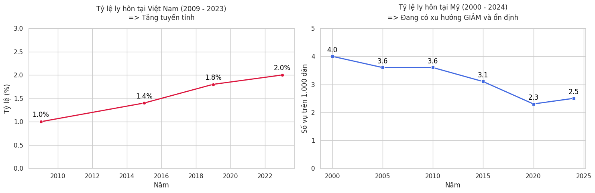

# Bản chất của tính thực dụng trong cuộc sống của quyển Quân Vương

## 1. Lời mở đầu

Cuốn sách Quân Vương (The Prince) được viết bởi một nhà ngoại giao, triết gia trong thời kì `Phục Hưng`, là cha đẻ khoa học chính trị hiện đại của người Italia tên `Niccolò Machiavelli` (1469-1527), ông nổi tiếng với tư tưởng thực dụng, áp dụng sự ranh ma, xoáy sâu vào bản chất con người.

## 2. Tại sao bạn nên đọc quyển sách này?

Nó mở ra cho bạn góc nhìn, cách tư duy, phản ứng của một người thực dụng trong xã hội đầy kẻ lừa lọc, phản bội, xảo trá lẫn nhau, trong cuốn này viết như vậy không có nghĩa là `Machiavelli` dạy bạn phải trở nên biết lừa lọc hay làm hại người khác mà là học cách để tự bảo vệ bản thân trước một xã hội nhiều kẻ bạn không để đoán trước được tâm cơ họ như nào, họ sẽ làm gì, hay nói một đường nhưng bên trong họ làm một nẻo.

Bản thân `Machiavelli` cũng khuyến khích mọi người làm điều tốt và sống lương thiện nhưng phải tuỳ bối cảnh và nơi đang hoạt động, ví dụ bạn không thể sống lương thiện trong một môi trường công sở hay nơi làm việc khi mà mọi người đều muốn bạn làm theo ý họ, bạn không thể từ chối chỉ vì sợ bị đánh giá là xa cách, khó gần, hay thiếu hoà đồng. Mà điều này quá rõ ràng nếu giả sử bạn muốn đi về nhà nghỉ ngơi sau ngày làm việc mệt mỏi mà những người đồng nghiệp lại rủ bạn đi ăn uống, chơi nhởi, thì thật sự nó không đem lại nhiều giá trị nếu bạn không thực sự muốn là một người hoạt ngôn hay thích làm theo ý họ.

Theo góc nhìn của `Machiavelli` cuộc sống này không hề màu hồng mà ông nói về một thực tế trần trụi, chỉ cần bạn bước ra khỏi ngôi nhà an toàn của bạn, nơi mà bạn coi là chỗ an toàn nhất thì khi ra ngoài xã hội kia không thiếu kẻ sẵn sàng đạp bạn xuống, hạ bệ bạn, thậm chí là những người bạn, đồng nghiệp bạn coi là thân nhất có thể tin tưởng họ và coi như thể họ sẽ luôn đứng về phía mình thì bạn đã nhầm, `Machiavelli` không hoàn toàn khuyến khích bạn nghĩ theo hướng màu hồng vậy tất nhiên bạn nên dành suy nghĩ tốt bụng đó khi về ngôi nhà an toàn với những người thân yêu là tốt nhất, bởi vì ngay cả bạn bè dù thân nhất cũng có thể phản bội chúng ta, tôi xin nhấn mạnh là có thể ngụ ý chỉ một khả năng không phải một lời khẳng định.

## 3. Bản chất con người và việc "Đeo mặt nạ"

### 3.1 Bản chất con người theo Machiavelli

Nếu nói đến việc đeo mặt nạ thì trước đây tôi có viết một bài phân tích về quyển `Thất lạc cõi người` của `Dazai Osamu` về việc đeo mặt nạ là con dao hai lưỡi như thế nào.
Bạn có thể đọc qua bài viết này: [Lớp mặt nạ hay nỗi cô độc](https://www.eurusdev.me/blog/dazai-osamu-lop-mat-na-coi-doc)

Dưới góc độ nhìn nhận con người của `Machiavelli`, bản chất con người là ích kỷ, thực dụng, tham lam và dễ thay đổi.

Về điểm thứ nhất ích kỷ và vụ lợi: về cơ bản con người luôn ích kỷ và nghĩ đến lợi ích của họ đầu tiên ví dụ khi một người bạn quen biết có thể gọi là thân mà họ nhờ vả điều gì đấy như mượn tiền hay làm một việc như hỗ trợ họ, điều đầu tiên bạn nghĩ tới mình có thiệt hay không đó điều chắc chắn, có thể một số người khi đọc dòng này sẽ tự ái mà cho rằng họ rất đạo đức và là một người thánh thiện trong sạch, nhưng thực tế là không, con người chỉ thể hiện bản mặt xấu xa nhất khi họ bị dòn vào đường cùng và không còn lối thoát, khi vào cảnh ngặt nghèo họ buộc phải sử dụng mọi khả năng nhất có thể để cứu sống chính mình.

### 3.2 Những dẫn chứng cho thấy bản chất con người

Vậy thì tôi xin đưa ra 2 dẫn chứng sau:

**Dẫn chứng thứ nhất: Thí nghiệm nhà tù Stanford**

`Thí nghiệm nhà tù Stanford (Stanford Prison Experiment)` thí nghiệm này được thực hiện bởi Giáo sư `Phillip Zimbardo` vào năm 1971, nghiên cứu này đửa những sinh viên đại học bình thường, có đạo đức tốt giả lập vào vai tù nhân và quản giáo và được giáo sư giám sát, khi bị ép buộc ở một môi trường khắt khe và ép buộc các sinh viên dưới vai trò quản giáo đã bộc lộ bản tính tàn nhẫn và sử dụng các hình phạt khắc nghiệt để áp bức các sinh viên vai trò tù nhân điều này nói lên rằng khi bạn ở trong môi trường bị gò ép và ép buộc, việc bộc lộ bản chất tàn nhẫn và đưa ra các hình phạt để áp bức những kẻ yếu hơn dù ban đầu các sinh viên này hoàn toàn bình đẳng và được đánh giá là bình thường ở ngoài đời.

**Dẫn chứng thứ hai: Thảm hoạ trên đỉnh Everest (1996)**

`Thảm hoạ trên đỉnh Everest (1996)`: các đoàn thám hiểm trên `Mount Everest` là một minh chứng thực tế cho thấy rõ nét nhất khi mà đối mặt với bão tuyết, thiếu oxy và sự mong manh giữa sự sống và cái chết điều duy nhất họ có thể làm là phải cứu sống bản thân họ trước điều này đánh đổi một cái đạo đức mang tính chất quyết định họ phải bỏ mặc những người đồng đội khác trong đoàn đang hấp hối để cứu mạng sống của chính họ.

## 4. "Còn lợi ích là còn tình cảm"

Điều này có lẽ bạn đã thấy rất nhiều trong đời sống hàng ngày rồi, trên các nền tảng mạng xã hội thì không thiếu về chủ đề này. Tuy nhiên tôi sẽ chia sẻ góc nhìn của mình về quan điểm của `Machiavelli` ông ấy nói rằng tình cảm dựa trên lợi ích, nhưng sẽ có người nói rằng tình cảm giữa người với người ngoài xã hội để có cái gọi là tình cảm nó vốn được xây dựng dựa trên lợi ích với nhau nhiều hơn là xuất phát từ tình cảm hay cái chân thật nhất, mà nếu nói về chân thật thì chả ai dại gì mà để lộ cái tôi bé bỏng của họ ra đâu mà kiểu gì cái tôi cũng gào thét lên và bảo vệ mọi quan điểm của họ cho bằng được thì thôi.

Có một điều bạn cứ để ý mà xem lúc bạn còn bé như mẫu giáo, học cấp 1, cấp 2 bạn có rất nhiều bạn bè, mọi thứ rất vui vẻ và hồn nhiên khi mà bạn chưa hề bị nhốm màu bởi ý thức hệ của xã hội nào là ra đường phải thể hiện được sự khôn ngoan, hơn đời để tránh bị thiệt về cơ bản thì không ai muốn mình hại hay chà đạp người khác vì lợi ích của mình cả mà chắc chắn là bảo vệ chính họ đầu tiên. Và khi bạn còn bé như vậy bạn chơi với những người bạn cảm thấy không có chút toan tính thử nghĩ mà xem có khi nào bạn còn bé tí chơi với những người bạn ở trường hay ở xóm lại nghĩ rằng chơi với những đứa này có giúp mình giàu lên hay tiến bộ không. Câu trả lời thì quá rõ rồi con nít thì chỉ có ăn ngủ, chơi và học thôi chứ đâu có thể nghĩ toan tính như vậy.

### 4.1 Tỉ lệ ly hôn gia tăng - Minh chứng cho tính thực dụng

Thêm một điều nữa bạn thấy rằng hầu hết các cặp đôi nam nữ yêu nhau hiện tại với tỉ lệ chia tay và ly hôn gia tăng tuyến tính.

Có thể thấy rằng tỉ lệ ly hôn tại Việt Nam từ 2009-2023 đang có xu hướng tăng dần tính từ 1.0% năm 2009 và con số này vẫn tiếp tục tăng theo `Tổng cục Thống kê Việt Nam`.

### 4.2 Kết luận: Lợi ích là nền tảng của tình cảm

Kết luận: Khi lợi ích còn thì tình cảm mới được duy trì, tôi khẳng định luôn cái tình cảm gọi là thuần tuý thiêng liêng ấy chỉ tồn tại dưới dạng cha mẹ với con cái, ông bà cháu chắt và gia đình với nhau còn hiếm lắm 1% ngoài kia nam nữ mà đến với nhau vì cái thuần tuý thì thật sự đếm trên đầu ngón tay so với một xã hội văn hóa lướt quẹt trái phải khi mà con người tự bán chính mình như một món hàng rẻ tiền.

## 5. Cáo và Sư tử - Triết lý cốt lõi của Machiavelli

Vậy thì quay lại vấn đề chính `Machiavelli` có một tư tưởng cốt lõi tại sao quân vương đôi khi phải làm cáo và đối khi phải làm sư tử.

Ông ấy có câu thế này:

> Người nào muốn sống thánh thiện giữa một tập thể toàn những kẻ vô lại thì kẻ đó sớm bị hủy diệt.

Điều ông ấy muốn nói ở đây là bạn không thể để mình là một người hoàn toàn đạo đức ở một nơi mà toàn những kẻ vô lại (ích kỷ, lừa lọc, tham lam, toan tính) có người nói rằng chúng ta phải là người có đạo đức, ngay cả đứa trẻ cũng được dạy như vậy kiểu như con phải trở thành người có đạo đức nha con, nhưng không ai dạy chúng ta rằng có đạo đức là đúng nó hoàn toàn là điều khuyến khích và được dạy từ nhỏ từ gia đình đến nhà trường và xã hội nhưng hiếm ai dạy rằng phải vừa có đạo đức và có sự ranh ma tuỳ tình huống mà biết dùng đạo đức hoặc phải biết vứt bỏ đạo đức đúng lúc để bảo vệ mình.

Những lúc cần sự ranh ma của cáo và cần sự hung hăng của sư tử nếu chỉ có một trong hai, e khó là sống an toàn trong xã hội đầy rẫy cạm bẫy. Nếu chỉ sống như sư tử thì dễ rơi vào cạm bẫy của cáo, nhưng nếu sống quá tinh ranh như cáo thì lại thiếu đi sức mạnh dễ bị kẻ có quyền lực hơn áp bức cho nên mới cần một trong hai.

## 6. Được yêu hay được sợ?

Đây là bài học lớn nhất về quản trị kỳ vọng và thiết lập uy quyền. Không phải trở thành kẻ áp bức người khác mà là trở thành lãnh đạo có cái đầu lạnh.

### 6.1 Ba câu cốt lõi của Machiavelli

Ba câu cốt lõi `Machiavelli` viết như sau:

- "Tốt nhất là vừa được yêu thương vừa bị sợ hãi; nhưng nếu không thể có cả hai, thì bị sợ hãi an toàn hơn nhiều so với được yêu thương."
- "Tình yêu được duy trì bằng sợi dây nghĩa vụ, thứ mà con người vốn dĩ ích kỷ sẽ sẵn sàng cắt đứt bất cứ khi nào họ thấy có lợi; nhưng sự sợ hãi được duy trì bằng hình phạt, thứ mà họ không bao giờ dám ngó lơ."
- "Quân vương phải khiến người ta sợ nhưng không được để bị ghét. Ông ta sẽ làm được điều đó nếu không đụng đến tài sản và phụ nữ của công dân mình."

### 6.2 Giải thích thực tế

Nói đơn giản ra thì như này khi bạn để một đứa trẻ trong nhà yêu thương bạn nhưng nó chỉ là trẻ con nếu bạn chỉ dùng cái được yêu thương để nó nghe lời và ăn một chén cơm hay đi học bài thì đó là sự thiếu hụt về phương pháp, mà phải có sự răn đe, nghiêm trị, nôm na là `Thương cho voi cho vọt` chứ không ai thương yêu con cái mà không sử dụng đến các biện pháp roi vọt cả hay sự nghiêm trị cả ngay cả trong công ti đi làm điều bạn sợ hãi nhất là gì có phải sự nghiêm khắc vốn có bắt buộc của công ty không nếu như họ không có mấy cái quy tắc để răn đe kiểu bạn phải đi làm đúng giờ, đạt `kpi`. Thì kiểu gì bạn cũng đi làm muộn, hoặc muốn làm gì thì làm mà không lo sợ mất việc.

Cho nên `Machiavelli` đã viết ra yếu tố cốt lõi trên nhằm nhắc nhở chúng ta rằng đừng chỉ để người khác quý mến bạn mà bạn phải để cho nể sợ bạn, cảm thấy bạn là người không dễ bị chèn ép và lấn lướt được bạn. Nhiều lúc bạn cứ giữ cái gọi là được người ta quý hay yêu mến nơi làm việc thì đôi khi họ nói gì bạn cũng khó từ chối bởi vì họ đã nắm thóp bạn là người dễ bị lấn lướt không biết cách xử sự cho khéo, không biết vị thế của mình và bảo vệ năng lượng của mình như nào.

## 7. Cách ra đòn - Đau một lần hay đau âm ỉ?

Ông ấy có một tư tưởng cốt lõi nữa là khi nghiêm trị dân chúng thì phải trừng phạt thích đáng thật dứt khoát không để nó kéo dài bị điều này sẽ làm dân chúng ghét bạn và lật đổ bạn nhưng khi ban phát ân huệ thì phải từ từ từng chút một kéo dài một cách nhỏ giọt thì từ từ nó mới thấm được.

## 8. Đối đầu với Số phận (Fortuna) và Bản lĩnh (Virtù)

Khi số phận hay khó khăn và bất lợi bất ngờ ập đến bạn chọn hành động lạnh lùng, cần trọng, nghe ngóng và thu thập tình hình hay hành động dứt khoát, mãnh liệt và đưa ra nước đi táo bạo. Ông ấy nói rằng:

- "Tôi tin rằng thà táo bạo còn hơn thận trọng, vì Số phận là một người đàn bà, và nếu bạn muốn chế ngự nàng, bạn phải đánh đập và dằn mặt nàng."
- "Số phận giống như một trong những dòng sông dữ dội... nhưng điều đó không có nghĩa là khi thời tiết yên bình, con người ta lại không thể xây đê đắp đập từ trước."

Điều ông ấy nói trên không phải để bạn trở thành vũ phu hay kẻ hung tàn điên rồ mà bạn cần phải nắm ý ở đây:

Trong những tình huống mang tính chất quan trọng và quyết định khi mà không còn đường lùi bạn không thể đi tà tà trên hành trình sự nghiệp của mình được nếu bạn nói thôi để tôi từ từ tính toán và xem lại kế hoạch thì nói thật là bạn mất tất cả rồi. Nhưng nếu bạn đi nước đi táo bạo là sẵn sàng dấn thân vào thời khác cuối cùng thì đó là lựa chọn sáng suốt bởi vì nó có thể thay đổi cả cuộc sống của bạn nếu cứ mãi đi tà tà như vậy.

## 9. Kết lại

Tôi học được sự ranh ma của cáo, sự hung hăng của sư tử, cách sử dụng sự ranh ma của cáo để bảo vệ mình. Nó giúp tôi bớt ngây thơ và nhìn xã hội này một cách đầy tính toán hơn chủ động hiểu các nước đi của đối phương, tại sao họ lại tốt với mình, cách để từ chối khi bản thân không muốn làm theo mà vẫn giữ được sự hoà hảo giữa các bên. Thì tôi nghĩ bạn cũng nên đọc quyển này một lần biết đâu nó thay đổi cuộc đời bạn thì sao.

## 10. Bảng ghi chú các bài học chính

| **Chủ đề**              | **Câu trích dẫn kinh điển**                                                                                 | **Bản chất thực dụng**                                                                          |
| ----------------------- | ----------------------------------------------------------------------------------------------------------- | ----------------------------------------------------------------------------------------------- |
| **Bản chất Con người**  | "Người nào muốn sống thánh thiện giữa một tập thể toàn những kẻ vô lại thì kẻ đó sẽ sớm bị hủy diệt."       | Đừng dùng tư duy của thánh nhân để quản trị một tập thể ích kỷ; phải biết thực tế và linh hoạt. |
| **Cáo và Sư tử**        | "Một quân vương khôn ngoan cần biết cách học hỏi từ bản chất của loài thú, biết đóng vai cả cáo lẫn sư tử." | Phải vừa có sức mạnh để răn đe kẻ thù, vừa có mưu mẹo để nhận biết nguy hiểm.                   |
| **Động lực con người**  | "Con người quên cái chết của cha mình nhanh hơn là quên việc bị mất tài sản."                               | Động lực kinh tế và lợi ích cá nhân là thứ chi phối hành vi con người mạnh mẽ nhất.             |
| **Nhìn nhận con người** | "Bởi vì về con người, ta có thể nói chung thế này: họ là lũ vô ơn, lật lọng, giả tạo."                      | Cái nhìn trần trụi về con người để chuẩn bị tâm lý, tránh việc đặt niềm tin ngây thơ.           |
| **Yêu vs Sợ**           | "Tốt nhất là vừa được yêu thương vừa bị sợ hãi; nhưng nếu không thể có cả hai, thì bị sợ hãi an toàn hơn."  | Quyền yêu thương thuộc về người khác, quyền sợ hãi thuộc về bạn.                                |
| **Duy trì quyền lực**   | "Tình yêu được duy trì bằng sợi dây nghĩa vụ, nhưng sự sợ hãi được duy trì bằng nỗi sợ hình phạt."          | Luật pháp và kỷ luật luôn có sức nặng hơn lời hứa hay lòng biết ơn.                             |
| **Ranh giới an toàn**   | "Quân vương phải khiến người ta sợ nhưng không được để bị ghét; ông ta không được đụng đến tài sản."        | Ranh giới giữa "nể sợ" và "căm ghét" rất mong manh.                                             |
| **Thuật ra đòn**        | "Những tổn thương cần được giáng xuống cùng một lúc; ân huệ nên được ban phát từng chút một."               | Trừng phạt thì làm một lần dứt khoát; ban thưởng thì chia nhỏ để lâu dài.                       |
| **Bản lĩnh**            | "Tôi tin rằng thà táo bạo còn hơn thận trọng, vì Số phận là một người đàn bà."                              | Khi đối mặt biến cố, hành động liều lĩnh có cơ hội lật ngược thế cờ cao hơn.                    |
| **Chuẩn bị trước**      | "Số phận giống như một dòng sông dữ dội nhưng con người ta có thể xây đê đắp từ trước."                     | Phải chủ động chuẩn bị các phương án dự phòng từ trước khi khủng hoảng ập đến.                  |
| **Bề ngoài**            | "Mọi người đều nhìn thấy những gì bạn tỏ ra, nhưng rất ít người cảm nhận được bạn thực sự là ai."           | Khán giả chỉ đánh giá qua bề ngoài. Quản trị hình ảnh cá nhân là cực kỳ quan trọng.             |
| **Kết quả**             | "Một quân vương không cần phải có mọi phẩm chất tốt, nhưng thiết yếu là phải TỎ RA có chúng."               | Không cần hoàn hảo, nhưng phải biết cách thể hiện sự chuyên nghiệp đúng lúc.                    |
