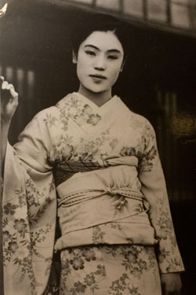

# 1. Bước vào đường hầm

## **_Con tàu vượt qua cái hầm dài ở ranh giới, thì tới xứ tuyết_**

Câu mở đầu của tác phẩm Xứ tuyết đã đưa người đọc đi chuẩn bị bước qua ranh giới giữa thế giới thực qua `cái hầm dài` ở ranh giới, tới xứ tuyết là nơi hư ảo. Trong chuyến tàu nhân vật chính `shimamura` chán nản cuộc sống thực tế ở `Tokyo` để đến với `Xứ Tuyết` Nằm ở một thị trấn suối nước nóng (onsen) hẻo lánh nằm ở vùng núi phía tây rặng  Alps Nhật Bản thuộc tỉnh Nigata ngày nay

Cảm giác `trắng xoá` khi bước từ thế giới thực qua thế giới `hư ảo` là một sự chuyển giao giữa hai thế giới, tuyết bao phủ vùng trắng xoá ấy, trong chuyến tàu một cô gái tên `Yoko` sở hữu vẻ đẹp phản chiếu qua kính tàu chồng lớp lên phong cảnh núi tuyết bên ngoài nó gợi lên cho tôi cái vẻ đẹp `ảo ảnh` thật lạnh lẽo dưới cái thời tiết của thế giới khác này. Tạo nên một sự mơ hồ khó chạm đến được nhưng lại rất muốn sở hữu nó.

# 2. Shimamura - Kẻ "Ngoại tình" với cái đẹp (phân tích nhân vật chính)

## Shimamura là ai? Anh ta tìm kiếm điều gì ở nơi lạnh lẽo tận cùng `Xứ tuyết này`?

Shimamura một người đàn ông thừa kế gia sản, một tài tử, nói đúng hơn là người có cuộc sống dư giả ấm no, anh ta có vợ và con cái, nhưng lại cảm thấy `trống rỗng` cuộc sống thường nhật nơi hiện đại `Tokyo`, một cuộc sống đầy đủ tiện nghi, không lo nghĩ, nhưng sâu bên trong anh ta là một người tìm kiếm điều gì đó ở vẻ đẹp của nghệ thuật

Sự mâu thuẫn của một kẻ yêu cái đẹp nhưng lại sợ trách nhiệm, có thể nói đơn giản là người đã có vợ con nhưng lại thích ngoại tình hú hí với gái trẻ đẹp mà ở đây là những hai cô `Geisha`, cho nhưng ai chưa biết thì `Geisha` là những cô gái làm nghệ thuật, biểu diễn đàn `shamisen`, múa, trò chuyện của khách hàng, mà `Geisha` thực tế có 2 loại chính

- Một là `Geisha` chuyên nghiệp, cao cấp, những `Geisha` thuần khiết, trong sạch ở thành phố
- Hai là `Geisha` theo bối cảnh của tác phẩm họ có thể bán thân mình vì ở nơi hẻo lánh này thì không có nhiều cơ hội để phát triển

Nhưng ở đây chúng ta không bàn đến vấn đề đạo lý mà bàn đến vẻ đẹp của nỗi buồn, của vẻ đẹp không thể chạm đến, sự nhiệt thành vô ích bởi vì
vấn đề đạo lý thì mọi thứ quá rõ ràng sai rồi

Vậy thì tại sao tôi lại nói đến sự mâu thuẫn của kẻ yêu cái đẹp nhưng lại sợ trách nhiệm, `Shimamura` có nghiên cứu hay nói đúng hơn là am hiểu tìm tòi về nghệ thuật ballet của phương Tây, nhưng điều thú vị ở chỗ anh ta không hề bao giờ đi xem họ biểu diễn bao giờ mà chỉ đơn thuần nghiên cứu thông qua giấy vở, tài liệu nghiên cứu -> Điều này cũng nói một phần trong tính cách anh này thích đẹp cao sang nhưng lại sợ dấn thân, trải nghiệm, có trách nhiệm với nó.

# 3. Komako - Ngọn lửa giữa băng giá (phân tích nữ chính)

## Đôi điều về `Komako`

**_Hình dưới đây mang tính chất mình hoạ dựa trên hình mẫu liên tưởng của tác giả_**
`Komako` là một `Geisha` ở xứ tuyết, là một người có nhiều kĩ năng đàn `shamisen`, múa, trò chuyện chuyên nghiệp với khách hàng
Nếu nói `Shimamura` là một người lý trí và lạnh lùng đại diện cho sự hờ hững thì có thể coi `Komako` là người phụ nữ của ngọn lửa ấm áp, nhiệt thành
`Shimamura` đã từng đến vùng này 3 lần theo các mùa Xuân, Thu, Đông mỗi lần lại mang đến cho anh một cảm giác mới mẻ của nơi đây, nơi này người mà mang lại cảm giác mới mẻ được yêu lại lần nữa, người phụ nữ tên `Komako` cho anh sự thoải mái tinh thần, sự khơi gợi thể xác, mang lại cho anh niềm vui mà cuộc sống thường nhật thành phố không có được, cô và anh đã tạo nên một sợi gắn kết chặt - anh luôn ngóng chờ cô đến phòng tại khu suối nước nóng là một điều quen thuộc. Cô luôn tỏ ra nhiệt thành, niềm nở, yêu anh đến nỗi không muốn rời xa, làm mọi thứ vì anh. Nhưng đáp lại với tình cảm và sự hi sinh của cô chỉ là sự lạnh lùng và giữ khoảng cách. Anh ta chỉ muốn giữ cô như vậy để thưởng thức cái đẹp, cái nhiệt thành ấy như một sự đổi mới trong cuộc sống nhàm chán hằng ngày. `Komako` luôn viết nhật ký rất chi tiết, đánh đàn `shamisen` rất hay - cái âm thanh cô toát ra khác hoàn toàn so với các `Geisha` chuyên nghiệp ở thành thị. Cô yêu `Shimamura` nhưng anh ta lại coi điều này là sự vô ích. Lý do với anh ta rất đơn giản: những gì cô làm chả tạo ra lợi ích gì. Dù cô yêu anh ta, anh ta cũng sẽ quay về `Tokyo`, và cô cũng chả được ích gì ngoài đau khổ thêm.
Nhưng khoan hãy ngẫm lại chút khi ý đồ của tác giả là muốn chúng ta hiểu được cái sự `vô ích` ấy lại chính là cái thứ đẹp đẽ nhất, cô yêu anh ta không phải vì cô ấy không biết hay ngây thơ mà chỉ đơn thuần cô sống thật với cảm xúc của chính mình, cô muốn được yêu bất kể sự đau khổ đáp lại cô như nào. Trong thực tế cuộc sống mọi thứ phải có ích phải có tính thực dụng phải tạo ra lợi nhuận và tiền bạc thì mới được coi là có lợi ích, khi một người học một ngôn ngữ mới thì trước đó họ đã tự hỏi liệu họ có học cho vui và coi nó là vẻ đẹp của ngôn ngữ hay không hay họ xác định nó là điều cần thiết bổ trở cho công việc của họ, có thể mở ra cơ hội tăng lương. Hoặc đơn cử là làm thơ, làm những điều mình muốn chỉ đơn giản là đi bộ, chơi một bản nhạc dù người khác nghe không hay nhưng giá trị bên trong nó mang lại chính là vẻ đẹp như tác giả trên theo ý tôi có thể diễn tả lại như sau:

> **Sự vô ích khi cố gắng vì một điều gì đó tạo ra một vẻ đẹp đến khó tả mà ngay cả những điều nhỏ nhặt nhất trong cuộc sống ta thường bỏ qua**

Nghe có vẻ không thực tế đúng không, khi mà thời đại AI hoá hiện tại tất cả mọi người đều chạy theo những thứ tạo ra lợi nhuận càng nhanh càng tốt, các cách kiếm tiền nhanh, học nhanh, ..... Mà ai lại đi ngược lại chỉ để ngồi làm việc vô ích đúng không? Tất nhiên điều tôi đang nói đến giá trị của một hành động chứ không khẳng định cho tất cả rồi

Tôi coi sự nỗ lực của `Komako` không hề vô ích mà thấy tội nghiệp cho cô ấy. Khi cố gắng hết sức cho một điều mà mình theo đuổi cho dù biết hay không biết kết quả của họ ra sao thì đó chắc chắn là một điều đáng hoan nghênh và đáng khen ngợi

# 4. Yoko - Hình ảnh vẻ đẹp đến hư ảo

Nhân vật này thì không có gì để nói nhiều cô ấy là người ở đầu đoạn tác phẩm người ở trên chuyến tàu phản chiếu qua kính cửa sổ chồng lấn lên phong cảnh tuyết trắng xoá ở bên ngoài nó như một sự đại diện của cái đẹp lạnh lẽo và ảo ảnh, trong xuyên suốt tác phẩm `Yoko` người chỉ thường xuất hiện qua kính hoặc cửa và gián tiếp từ xa trước `Shimamura` làm cho anh ta luôn mơ tưởng về cái đẹp ảo ảnh mà anh ta chỉ muốn chiêm ngưỡng nó. Nếu nói `Komako` là vẻ đẹp ấm áp của ngọn lửa có thể chạm vào, ôm lấy và cảm nhận được hơi ấm của sự ấm áp và chân thành thì ngược lại `Yoko` mang đến sự đẹp đẽ `thuần khiết` ,`mờ ảo`, `thanh khiết` khó có thể tiếp xúc được.

# 5. Dài ngân hà và sự buông bỏ

`Yoko` rơi xuống cảnh cháy cuối cùng. Khi cô rơi, `Shimamura` chỉ biết đứng nhìn và chiêm ngưỡng, không hành động, trong khi `Komako` cố gắng cứu cô nhưng đã quá muộn. Cái biểu tượng của vẻ đẹp ảo ảnh tan biến - và đó chính là khi Xứ tuyết từ bỏ sự hư ảo. Có lẽ tác giả Yasunari Kawabata muốn nói rằng vẻ đẹp thật sự chỉ xuất hiện khi ta buông bỏ nó. Chính sự ra đi ấy mới tạo nên vẻ đẹp tịch mịch, bất tận.
