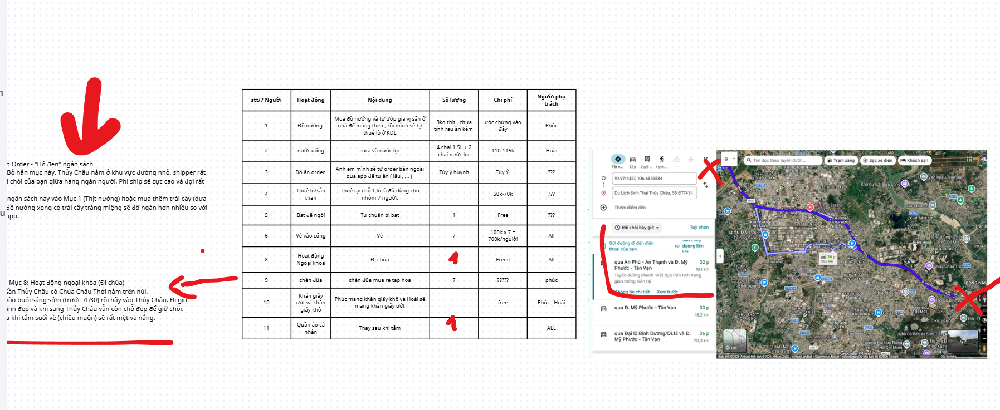
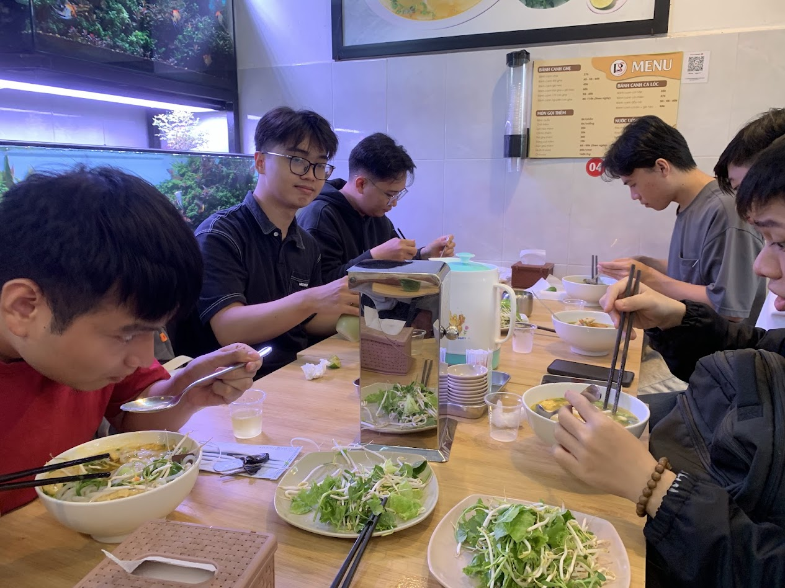
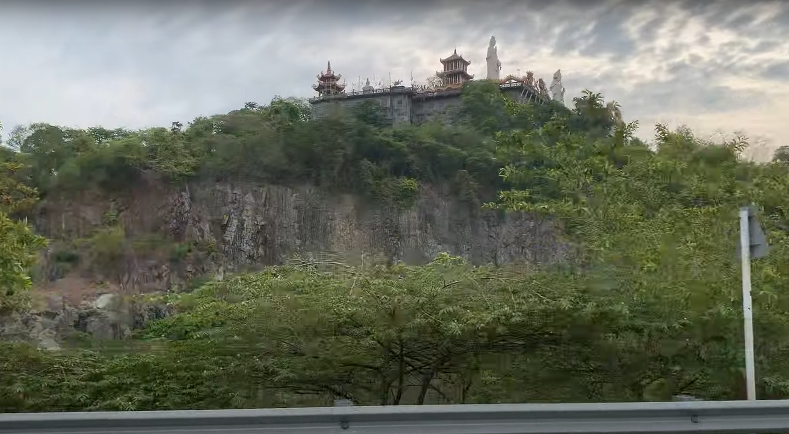
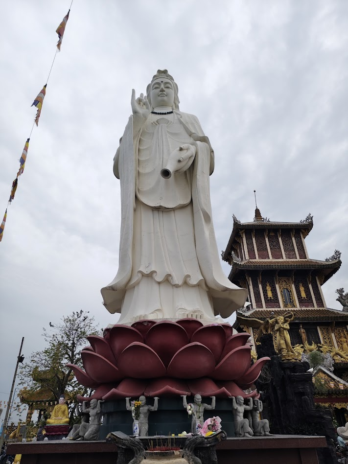
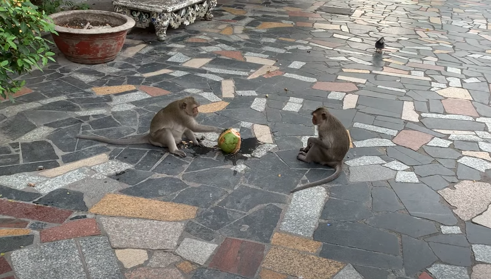
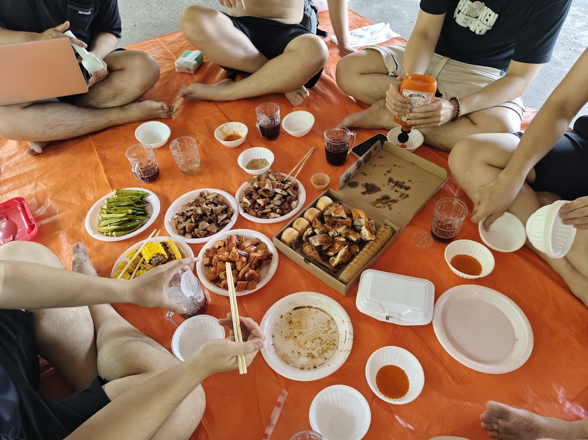
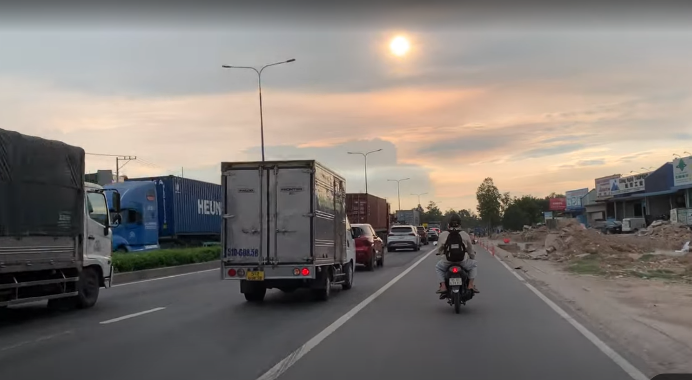

# Chuyến đi Thuỷ Châu - Châu Thới

16/05/2026

## Bối cảnh

Thời gian tíc tắc, tíc tắc trôi qua, tỉnh dậy hôm nay mọi thứ hôm qua tôi tưởng chừng sẽ diễn ra mà nay đã vút qua trong nháy mắt, chuyến đi Thuỷ Châu - Châu Thới của bọn tôi đã hoàn thành và mọi thứ đều diễn ra đúng kế hoạch, điều tôi học được là kinh nghiệm đi chơi xa như này với nhóm nhiều bạn như này, tôi thấy được nhiều thứ hay ho và trải nghiệm tuyệt vời mà khi ngồi nghiên cứu trong phòng với 4 bức tường không có được điều qua kế hoạch.

## Lên kế hoạch

Chúng tôi đã họp bàn, triển khai và lên ý tưởng gạch bỏ cả chục phương án khác nhau và cái khó là mỗi người 1 ý nào là khoảng cách, chi phí, công việc, lịch học, bận việc khác hoặc dù đơn thuần viện cớ và cuối cùng chọn được cái ý tưởng ban đầu bỏ qua lại hợp lý nhất. Chúng tôi lên kế hoạch, mọi người cùng brainstorm, chuẩn bị vé sẽ bao nhiêu, đồ ăn, chỗ ngồi, uống nước,.... Cả đi đường nào nữa, nói chung mọi thứ muốn hoàn chỉnh phải có kế hoạch cực kì chi tiết và quan trọng hơn là một người điều phối và thúc đẩy giải quyết khúc mắc của từng người, bằng không thì mỗi người một ý sẽ chẳng giải quyết được gì.

## Khởi hành

Một tuần sau chúng tôi xuất phát, nhóm chúng tôi chia làm 3 xe đi sau người tập trung chỗ tôi!

## Ăn sáng

Khi đến chỗ một người bạn khác của tôi cũng gần các điểm đến nói trên để ăn sáng, quán bánh canh cá lóc ở đó khá ngon và rẻ nữa.

Quán Bánh Canh

## Chùa Châu Thới

Sau đó chúng tôi đến chùa Châu Thới gần đó, ở đây rất yên tĩnh có rất nhiều khỉ và chim bồ câu, chỗ này rất nhiều tượng, ngày tôi đi là ngày rằm (Một sự trùng hợp đến lạ), chúng tôi mỗi người đi từng khu vực trong chùa thắp hương và cầu những điều may mắn cho cuộc sống.

Đường lên Chùa

Tượng quan âm

Khỉ uống dừa

## Khu sinh thái Thuỷ Châu

Tiếp đó chúng tôi xuống núi và đi tiếp đến khu sinh thái Thuỷ Châu, vé 100k/ người (chúng tôi đi 7 người), rồi tìm một chỗ nghỉ, tìm thuê bạt và lò nướng sau đó đi tắm các bãi thác, đá tôi thấy sảng khoái vì lâu rồi mới đi tắm như vậy, mấy giờ sau lên nướng đồ và ăn uống tiếp. Nghỉ ngơi lúc rồi tắm lần cuối rồi về.

ăn trưa

## Ghi chú cuối

Nói thật là tôi bị ý tưởng nên post này tôi không viết như các post trước được nên chỉ viết theo kiểu tuyến tính, nghĩ gì viết nấy thôi, phải chờ thời gian khi tôi nhận ra điều gì thì mới có cảm hứng viết được.

Đi về
